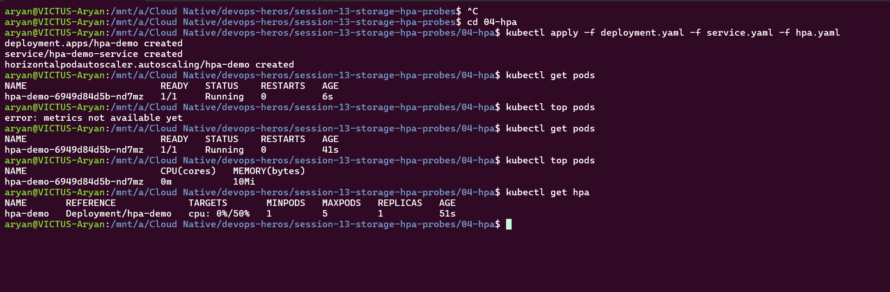
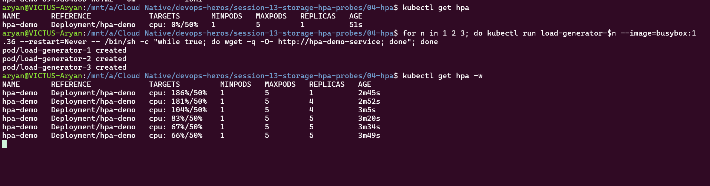
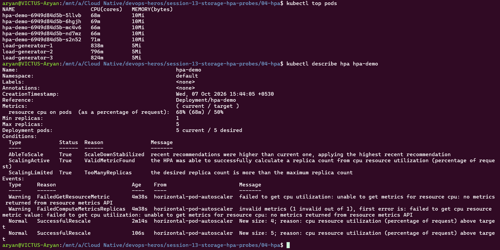
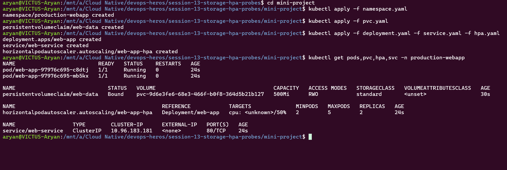
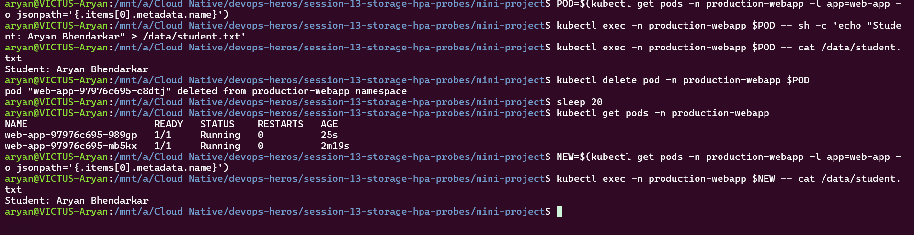
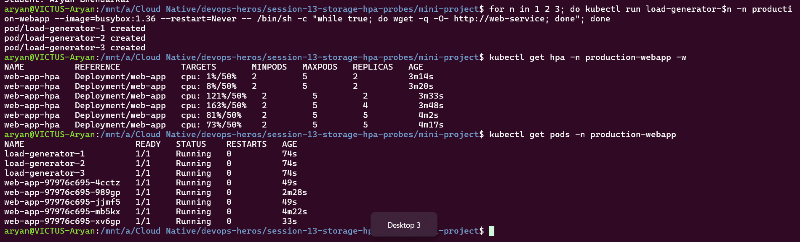

# Session 13 Homework: Kubernetes Storage, HPA & Probes

## Task 1: Kubernetes Volumes

A container's filesystem is temporary: its files are lost when it restarts. A **volume** is a folder attached to a Pod so data can outlive the container.

| Concept | What it is | Lifetime |
| :--- | :--- | :--- |
| **emptyDir** | Empty folder created with the Pod, shared by its containers | Deleted when the Pod is deleted |
| **hostPath** | A folder from the node's disk mounted into the Pod | Stays on the node after the Pod is deleted (not portable, avoid in production) |
| **PersistentVolume (PV)** | A piece of storage in the cluster, like a disk | Independent of any Pod |
| **PersistentVolumeClaim (PVC)** | A Pod's *request* for storage ("I need 500Mi, ReadWriteOnce"). Kubernetes binds it to a matching PV | Independent of any Pod |
| **StorageClass** | A template saying *what kind* of storage to create and which provisioner creates it. The cluster here has `standard (default)` | - |
| **Dynamic provisioning** | With a StorageClass you only write a PVC and Kubernetes **creates the PV automatically**, so no admin has to prepare disks | - |

```text
Pod ──► PVC (request) ──binds──► PV (actual storage) ◄── created automatically by StorageClass
```

Example (from `01-volumes/emptydir-pod.yaml`): the volume is defined under `volumes:` and attached to the container with `volumeMounts:`.
```yaml
volumes:
  - name: app-storage
    emptyDir: {}
volumeMounts:
  - name: app-storage
    mountPath: /data
```

Demo: data written to an emptyDir is gone once the Pod is deleted and recreated.


---

## Task 2: HPA Hands-on

**HPA (Horizontal Pod Autoscaler)** watches CPU usage and automatically adds or removes Pods. It needs the *metrics-server* and a CPU *request* on the container (utilization is a % of the request). Files used: `04-hpa/deployment.yaml`, `04-hpa/service.yaml`, `04-hpa/hpa.yaml` (min 1, max 5 Pods, target 50% CPU).

**Steps performed** (from `04-hpa/`):
```bash
kubectl apply -f deployment.yaml -f service.yaml -f hpa.yaml     # deploy app, service, HPA
kubectl get pods; kubectl top pods; kubectl get hpa              # baseline
for n in 1 2 3; do kubectl run load-generator-$n --image=busybox:1.36 --restart=Never -- /bin/sh -c "while true; do wget -q -O- http://hpa-demo-service; done"; done
kubectl get hpa -w                                               # watch scaling
kubectl get pods; kubectl top pods; kubectl describe hpa hpa-demo
```

**1. Baseline:** 1 Pod, CPU `0%/50%`.



**2. Under load:** CPU rose to 186% (target 50%), so HPA scaled the Deployment from 1 → 4 → 5 Pods. CPU then fell to ~66% as the load was shared across Pods.



**3. Result:** 5 `hpa-demo` Pods (about 66-71m CPU each; the load generators use ~800m each). `describe hpa` shows `5 current / 5 desired` and the `SuccessfulRescale` events (New size: 4, then 5). `ScalingLimited: TooManyReplicas` means HPA wanted more but is capped at `maxReplicas: 5`. The early `FailedGetResourceMetric` warning is normal: metrics-server needs a short time to report on new Pods.



---

## Task 3: Mini Project

The mini project (in `mini-project/`) combines three ideas in one app, inside its own namespace `production-webapp`:

| Part | File | What it does |
| :--- | :--- | :--- |
| Storage | `pvc.yaml` | PVC `web-data` (500Mi, ReadWriteOnce) mounted at `/data`, so data survives Pod deletion |
| Scaling | `hpa.yaml` | HPA scales the Deployment between 2 and 5 Pods at 50% CPU |
| Health | `deployment.yaml` | Startup, readiness and liveness probes. Startup checks it has booted, readiness decides whether the Pod gets traffic, liveness restarts a stuck container |
| Plus | `namespace.yaml`, `service.yaml` | Isolated namespace and a ClusterIP Service (`web-service`) in front of the Pods |

**1. Deploy:**
```bash
cd mini-project
kubectl apply -f namespace.yaml
kubectl apply -f pvc.yaml
kubectl apply -f deployment.yaml -f service.yaml -f hpa.yaml
kubectl get pods,pvc,hpa,svc -n production-webapp
```
2 Pods `Running`, PVC `web-data` `Bound` (500Mi, RWO, StorageClass `standard`, so the PV was created by dynamic provisioning), HPA min 2 / max 5, Service created. (`cpu: <unknown>` is normal in the first seconds, until metrics-server reports.)



**2. Storage persistence:** I wrote `/data/student.txt` from one Pod, deleted that Pod, and Kubernetes started a replacement. Reading the file from a Pod that was created afterwards still returned `Student: Aryan Bhendarkar`, because the data lives on the PVC, not in the Pod.



**3. HPA scaling under load:** I started 3 load-generator Pods. CPU rose to 163% (target 50%), and the HPA scaled the Deployment from 2 → 4 → 5 Pods (its maximum). CPU then dropped to 73% as the load spread across Pods.



**Cleanup:** `kubectl delete namespace production-webapp` removes the whole mini project.
