# Session 14 Homework: Kubernetes Troubleshooting

**Method used for every problem:** `GET` (what is the status?) → `DESCRIBE` / `EVENTS` (why?) → `LOGS` (what did the app say?) → `EXEC` (look inside) → **FIX** → **VERIFY**. Don't guess.

---

## Task 1: Kubernetes Commands

Pods used (teacher's files): `get-demo`, `logs-demo`, `exec-demo`, `events-demo`.

| Command | What it tells me |
| :--- | :--- |
| `kubectl get pods` | Quick list: name, READY, STATUS, RESTARTS, AGE |
| `kubectl get pods -o wide` | Adds the Pod IP and the node it runs on |
| `kubectl describe pod <name>` | Full detail: image, probes, conditions and the **Events** section at the bottom (best place to find *why* something failed) |
| `kubectl logs <name>` | What the application printed (`-f` follows, `--previous` shows the logs of the crashed container) |
| `kubectl exec <name> -- <cmd>` | Runs a command inside the container (`-it ... -- sh` for a shell) |
| `kubectl get events --sort-by=.metadata.creationTimestamp` | Recent cluster activity, oldest to newest |
| `kubectl explain pod.spec.containers.image` | Built-in documentation of any YAML field |
| `kubectl top pods` | CPU and memory usage (needs metrics-server) |

**get / get -o wide / describe**

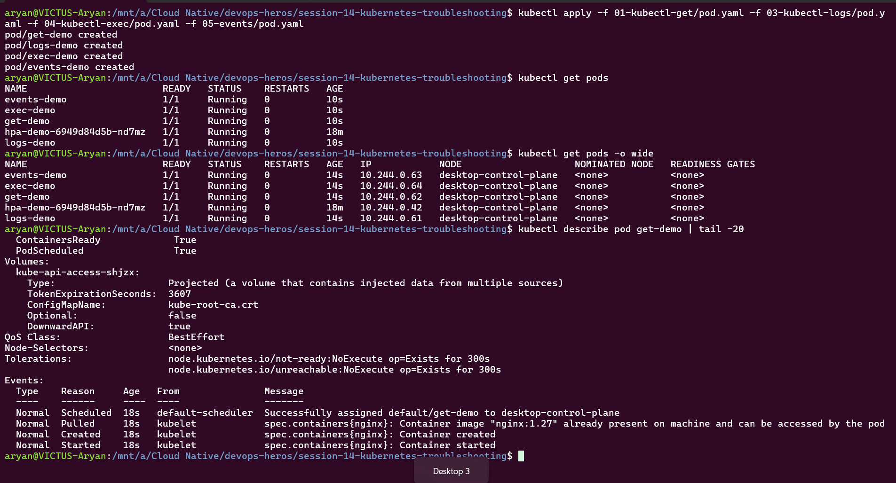

**logs / exec / events / explain / top**

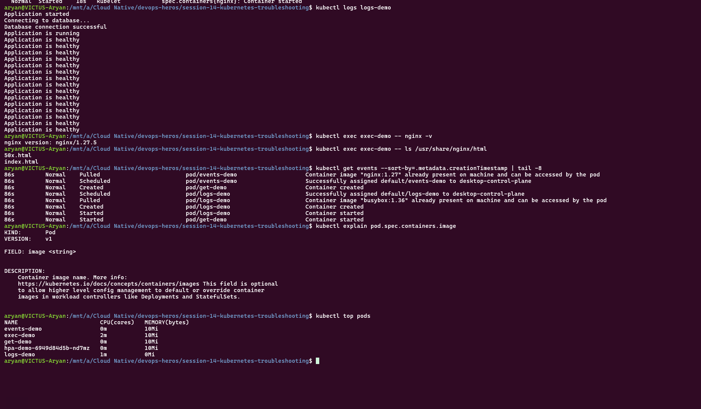

`logs` showed the app's startup messages, `exec` ran `nginx -v` (version 1.27.5) and listed the web folder inside the container, `events` showed Scheduled → Pulled → Created → Started for each Pod, and `top` showed the CPU/memory per Pod.

---

## Task 2: Troubleshoot Common Issues

All broken/fixed YAML files are the teacher's (`06-` to `09-` folders). A Pod's spec can't be edited in place, so Pod fixes are *delete + re-apply*; Service fixes use `kubectl patch`.

### 2.1 CrashLoopBackOff (`06-crashloopbackoff`)

- **Identify:** `kubectl get pod crash-demo` → `Error`, then `CrashLoopBackOff`, RESTARTS keeps increasing.
- **Investigate:** `kubectl describe pod crash-demo` → Events show `Back-off restarting failed container`; `kubectl logs crash-demo` → "Application starting... Something went wrong!"
- **Root cause:** the container's command ends with `exit 1`. The process exits immediately, so Kubernetes keeps restarting it with growing delays.
- **Fix:** `kubectl delete pod crash-demo` + `kubectl apply -f 06-crashloopbackoff/fixed-pod.yaml` (process stays alive and healthy).
- **Verify:** `Running`, `RESTARTS 0`, logs say "Application is healthy".

Before (broken):
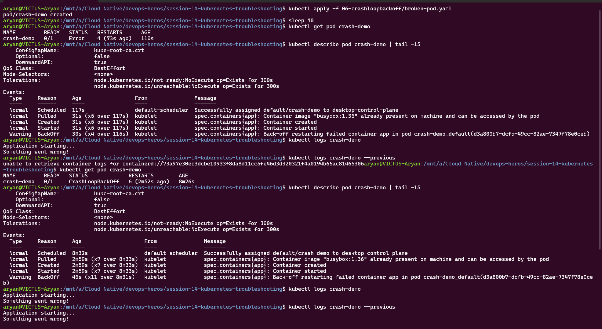

After (fixed):
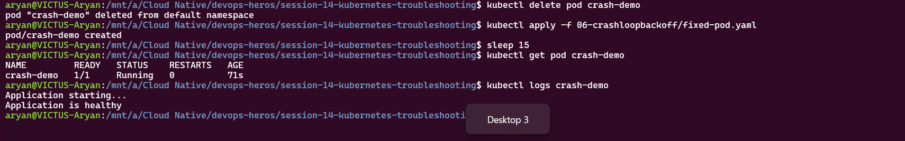

### 2.2 ImagePullBackOff / ErrImagePull (`07-imagepullbackoff`)

- **Identify:** `kubectl get pod image-demo` → `ErrImagePull`, then `ImagePullBackOff`, READY `0/1`. (`ErrImagePull` is the failed attempt, `ImagePullBackOff` means Kubernetes is waiting before retrying.)
- **Investigate:** `kubectl describe pod image-demo` → Events: `Failed to pull image "nginx:this-image-does-not-exist" ... not found`, then `Back-off pulling image`.
- **Root cause:** the image tag `nginx:this-image-does-not-exist` doesn't exist in the registry.
- **Fix:** delete the Pod and apply `07-imagepullbackoff/fixed-pod.yaml` (valid image `nginx:1.27`).
- **Verify:** Pod `Running`.

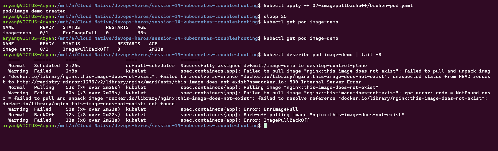
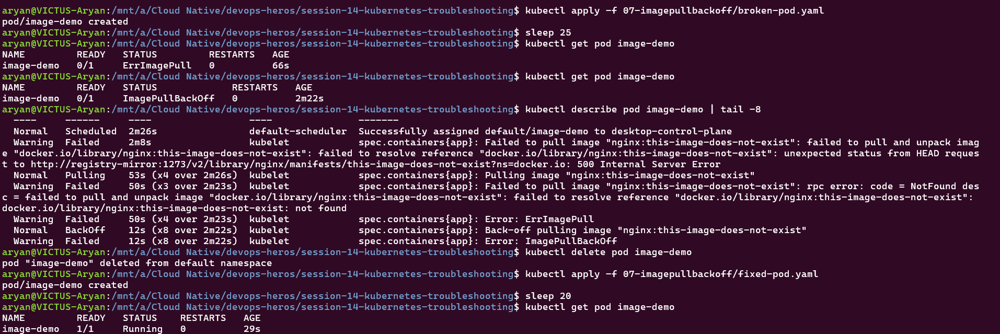

### 2.3 Pending (`08-pending-pods`)

- **Identify:** `kubectl get pod pending-demo` → `Pending`, READY `0/1`, no restarts (it never started).
- **Investigate:** `kubectl describe pod pending-demo` → Event: `FailedScheduling: 0/1 nodes are available: 1 node(s) didn't match Pod's node affinity/selector`.
- **Root cause:** the Pod has `nodeSelector: kubernetes.io/hostname: node-that-does-not-exist`, so the scheduler can't find any matching node.
- **Fix:** delete and apply `08-pending-pods/fixed-pod.yaml` (no nodeSelector).
- **Verify:** Pod `Running`.

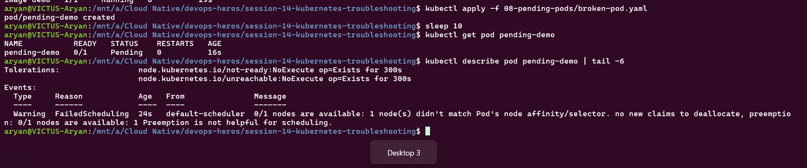
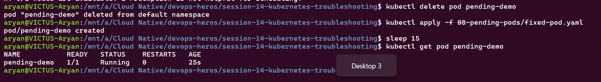

### 2.4 Service connectivity / selector (`09-service-dns-troubleshooting`)

- **Identify:** Service `web-service` exists but `kubectl get endpoints web-service` → `<none>`, so the Service has no backends.
- **Investigate:** `kubectl describe svc web-service | grep -i selector` → `app=web-ahsgdf`; `kubectl get pods --show-labels` → Pods are labeled `app=web`.
- **Root cause:** the Service selector doesn't match the Pod labels, so no Pods are selected.
- **Fix:** `kubectl patch svc web-service -p '{"spec":{"selector":{"app":"web"}}}'`.
- **Verify:** `kubectl get endpoints web-service` → `10.244.0.70:80,10.244.0.72:80`.

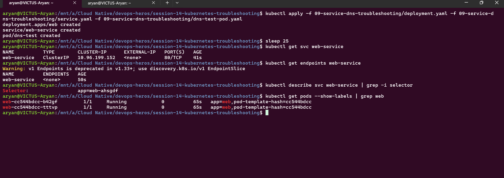

### 2.5 DNS and Pod networking (same folder)

- **Problem found on the way:** the teacher's `dns-test-pod.yaml` uses `registry.k8s.io/e2e-test-images/dnsutils:1.3`, which can't be pulled (`ImagePullBackOff`, "not found"). Same root cause as 2.2: a bad image tag.
- **Fix:** recreated the test Pod with `kubectl run dns-test --image=busybox:1.36 -- sleep 3600` (busybox includes `nslookup`).
- **Verify DNS works:** `kubectl exec dns-test -- nslookup web-service` resolves `web-service.default.svc.cluster.local` → `10.96.199.152` (the Service's ClusterIP). The extra `NXDOMAIN` lines above it are just busybox trying the other search suffixes first.
- **DNS failure case:** `nslookup does-not-exist` → `NXDOMAIN` on every suffix, meaning the name doesn't exist (typo, wrong namespace or missing Service).
- **Pod networking:** the Pod could reach the cluster DNS server (`10.96.0.10`) and the Service IP resolved, so Pod-to-Service networking is working.

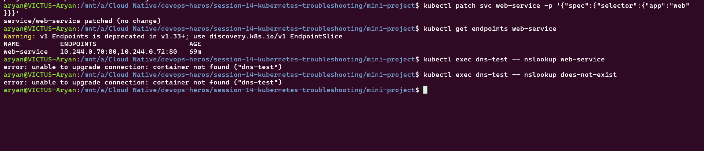

### 2.6 ContainerCreating and Configuration issues (explained, not executed)

I did **not** run hands-on scenarios for these two.

- **ContainerCreating:** the Pod is scheduled but the container isn't running yet. Typical causes are a slow image pull, a missing ConfigMap/Secret or PVC that the Pod mounts, or volume attach problems. Check with `kubectl describe pod` (Events mention the missing volume/secret).
- **Configuration issues:** wrong environment variables, a missing ConfigMap/Secret key, or a wrong port/probe path. Check with `kubectl describe pod`, `kubectl logs`, and `kubectl exec <pod> -- env`.

### Summary table

| Problem | What I saw | Command I used | Root cause | Fix |
| :--- | :--- | :--- | :--- | :--- |
| CrashLoopBackOff | STATUS `CrashLoopBackOff`, RESTARTS rising | `get`, `describe`, `logs` | Command ends with `exit 1` | Recreate with `fixed-pod.yaml` |
| ImagePullBackOff / ErrImagePull | `0/1`, `ErrImagePull` then `ImagePullBackOff` | `get`, `describe` (Events) | Image tag doesn't exist | Use a valid tag (`fixed-pod.yaml`) |
| Pending | `Pending`, no restarts | `get`, `describe` (Events) | `nodeSelector` names a node that doesn't exist | Remove it (`fixed-pod.yaml`) |
| Service has no endpoints | Endpoints `<none>` | `get endpoints`, `describe svc`, `get pods --show-labels` | Selector `web-ahsgdf` ≠ Pod label `web` | `kubectl patch svc` |
| DNS test Pod can't start | `ImagePullBackOff` on `dnsutils:1.3` | `get pod`, `describe pod` | Tag no longer exists | Use `busybox:1.36` |
| DNS name fails | `NXDOMAIN` | `kubectl exec dns-test -- nslookup` | Name doesn't exist | Use the correct Service name |

---

## Task 3: Mini Project

**Problem statement:** an Nginx Deployment (2 Pods) and a Service should serve traffic, but the team reports problems. Find and fix them, without guessing.

Files used (teacher's, in `mini-project/`): `deployment.yaml`, `service.yaml`, `broken-pod.yaml`.

### 3.1 Healthy baseline and the broken Pod

```bash
kubectl apply -f deployment.yaml -f service.yaml
kubectl apply -f broken-pod.yaml
kubectl get pods -o wide
kubectl describe pod project-broken-pod | tail -6
kubectl get endpoints troubleshooting-service
```
- The 2 `troubleshooting-app` Pods are `Running`, and the Service's endpoints list both Pod IPs (`10.244.0.73`, `10.244.0.74`), so the app itself is healthy.
- `project-broken-pod` is `0/1 ImagePullBackOff`.

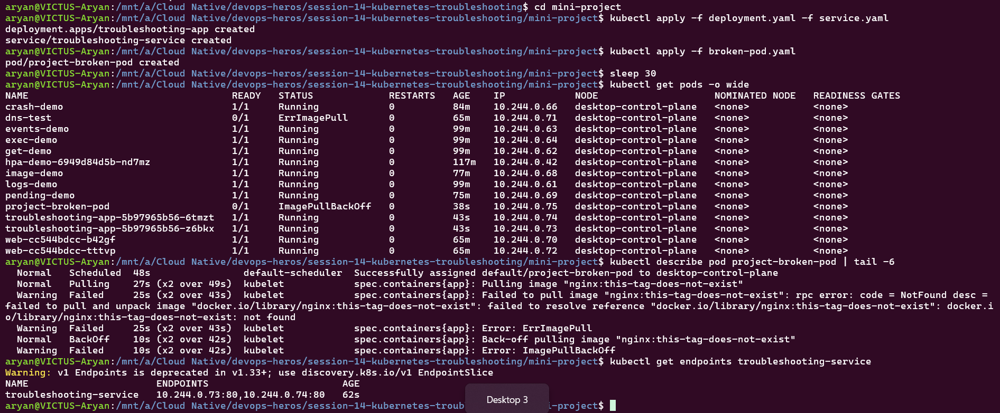

**Answers to the teacher's questions:**
1. **Pod status?** `ImagePullBackOff` (first `ErrImagePull`).
2. **Actual error?** `Failed to pull image "nginx:this-tag-does-not-exist": ... docker.io/library/nginx:this-tag-does-not-exist: not found`.
3. **Which command found it?** `kubectl describe pod project-broken-pod`, in the **Events** section.
4. **What's wrong with the image?** The tag `this-tag-does-not-exist` isn't published for `nginx`.
5. **How to fix it?** Point the Pod at a valid tag, e.g. `nginx:1.27`.

### 3.2 Service selector problem

I changed the Service selector to `wrong-app` on purpose:
```bash
kubectl patch svc troubleshooting-service -p '{"spec":{"selector":{"app":"wrong-app"}}}'
kubectl get endpoints troubleshooting-service            # <none>
kubectl describe svc troubleshooting-service | grep -i selector   # app=wrong-app
kubectl get pods --show-labels                           # Pods are app=troubleshooting-app
```
- **Root cause:** Service selector `wrong-app` ≠ Pod label `troubleshooting-app`, so the Service selects no Pods.

### 3.3 Fix and verify

```bash
kubectl patch svc troubleshooting-service -p '{"spec":{"selector":{"app":"troubleshooting-app"}}}'
kubectl get endpoints troubleshooting-service            # 10.244.0.73:80,10.244.0.74:80
kubectl set image pod/project-broken-pod app=nginx:1.27
kubectl get pod project-broken-pod                       # Running
```

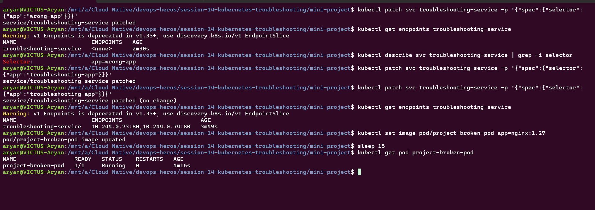

| Problem | Before | After |
| :--- | :--- | :--- |
| Broken image | `ImagePullBackOff` | `Running` (`nginx:1.27`) |
| Service selector | Endpoints `<none>` | Endpoints `10.244.0.73:80,10.244.0.74:80` |

### README questions

1. **What does `kubectl get` tell us?** The status of resources: names, READY, STATUS, restarts and age. It's the first quick check.
2. **`get` vs `describe`?** `get` is a short summary. `describe` is the detailed view with configuration and the Events log explaining *why* something happened.
3. **Why `kubectl logs`?** To see what the application itself printed, e.g. error messages from a crashing app. `--previous` shows the last crashed container.
4. **When `kubectl exec`?** To run commands inside a running container, e.g. test connectivity (`curl`, `nslookup`), check files or environment variables.
5. **`CrashLoopBackOff`?** The container starts, crashes, and Kubernetes keeps restarting it with increasing delays.
6. **`ImagePullBackOff`?** Kubernetes can't pull the image (wrong name/tag, missing registry access) and is waiting before retrying.
7. **Why `Pending`?** The scheduler can't place the Pod: no matching node (nodeSelector/affinity), insufficient CPU/memory, or an unbound PVC.
8. **Why a Service with no endpoints?** Its selector matches no Ready Pods, usually because of a label mismatch, or the Pods aren't Ready.
9. **Selector vs Pod labels?** The Service sends traffic to Pods whose labels match its selector exactly; if they differ, the Service has no backends.
10. **Kubernetes DNS?** The cluster DNS service (CoreDNS) gives Services and Pods names, e.g. `web-service.default.svc.cluster.local`, so Pods can reach each other by name instead of IP.

### Troubleshooting checklist

`get` → `describe` (Events) → `logs` → `exec` → fix → verify. For Services: `describe svc`, `get endpoints`, compare selector and labels, `nslookup`.
