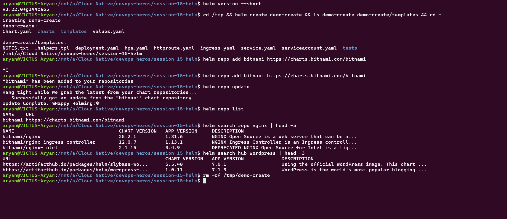
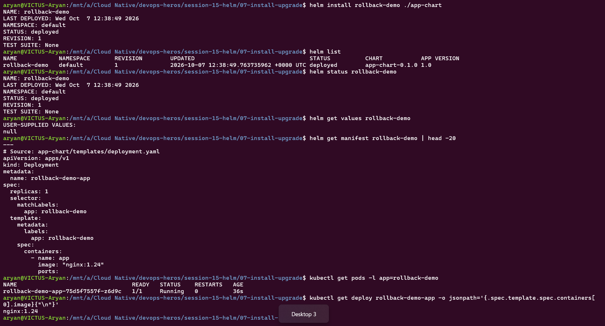
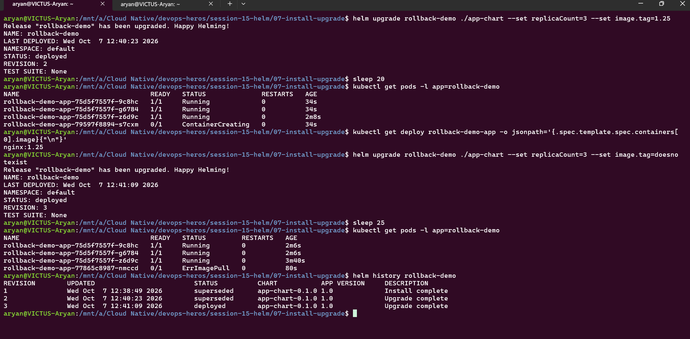
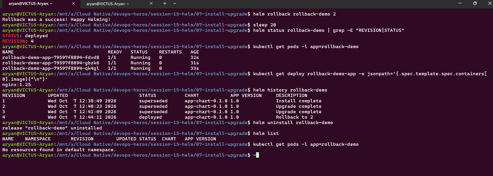
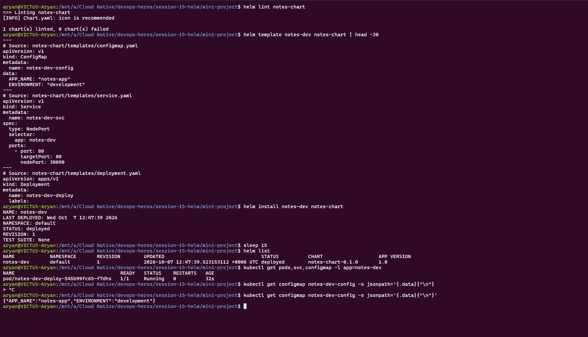
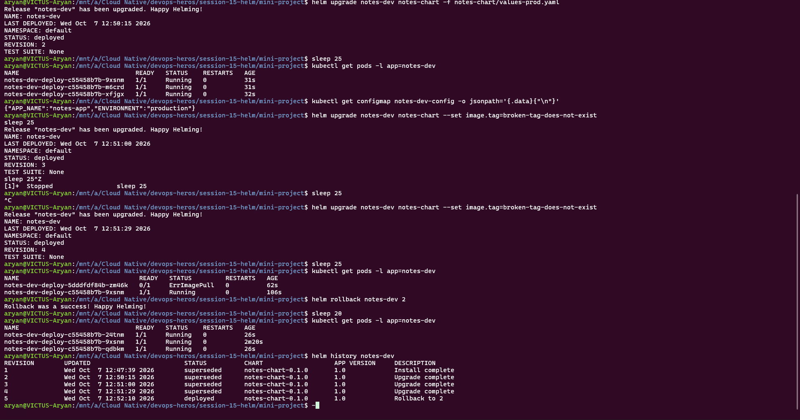

# Session 15 Homework: Helm

**Helm** is the package manager for Kubernetes. A **chart** is a package of templated Kubernetes YAML (`templates/`) plus default settings (`values.yaml`). Installing a chart creates a **release**, and every install, upgrade or rollback creates a numbered **revision** you can return to.

```text
Chart (templates + values) ──helm install──► Release (revision 1) ──helm upgrade──► revision 2 ──helm rollback──► revision N
```

Environment: Docker Desktop Kubernetes, Helm v3.22.0. Charts used are the teacher's: `07-install-upgrade/app-chart` and `mini-project/notes-chart` (nothing was rewritten).

---

## Task 1: Helm Commands

Every command below was run for real. The screenshots are in the sections that follow.

| Command | What it does | Shown in |
| :--- | :--- | :--- |
| `helm create <name>` | Generates a starter chart: `Chart.yaml`, `values.yaml`, `templates/`, `charts/` | Screenshot 1 |
| `helm repo add / update / list` | Adds a chart repository (like an app store), refreshes it, lists configured repos | Screenshot 1 |
| `helm search repo <word>` | Searches charts inside the repos you added | Screenshot 1 |
| `helm search hub <word>` | Searches the public Artifact Hub | Screenshot 1 |
| `helm install <release> <chart>` | Deploys a chart as a named release (revision 1) | Screenshots 2, 5 |
| `helm list` | Lists releases with revision, status and chart version | Screenshots 2, 4, 5 |
| `helm status <release>` | Shows the state of one release | Screenshots 2, 4 |
| `helm get values <release>` | Shows the user-supplied values (`null` when defaults are used) | Screenshot 2 |
| `helm get manifest <release>` | Shows the final rendered YAML that Helm sent to Kubernetes | Screenshot 2 |
| `helm upgrade <release> <chart>` | Applies a new config or version as a new revision (`--set` or `-f file`) | Screenshots 3, 6 |
| `helm history <release>` | Lists all revisions and their status | Screenshots 3, 4, 6 |
| `helm rollback <release> <rev>` | Returns to an earlier revision (creates a *new* revision) | Screenshots 4, 6 |
| `helm uninstall <release>` | Removes the release and all resources it created | Screenshot 4 |
| `helm lint` / `helm template` | Checks a chart for errors / renders it locally without installing | Screenshot 5 |

### Screenshot 1: create, repo, search



`helm create demo-create` produced `Chart.yaml`, `charts/`, `templates/` and `values.yaml` (the scaffold was made in `/tmp` and then deleted). I added the Bitnami repo, searched it for `nginx` (`bitnami/nginx`, chart 25.2.1) and searched Artifact Hub for `wordpress`. My first `repo add` hung and I re-ran it, which is why it appears twice.

---

## Task 2: Helm Rollback

Chart: `07-install-upgrade/app-chart` (a Deployment with `replicaCount` and `image.tag` taken from values). Release name: `rollback-demo`.

```text
Install (rev 1) → Verify → Upgrade (rev 2) → Verify → Upgrade again, broken (rev 3) → Verify → Rollback to 2 (rev 4) → Verify
```

### Step 1: Install and verify (revision 1)

```bash
helm install rollback-demo ./app-chart
helm list; helm status rollback-demo; helm get values rollback-demo
helm get manifest rollback-demo | head -20
kubectl get pods -l app=rollback-demo
kubectl get deploy rollback-demo-app -o jsonpath='{.spec.template.spec.containers[0].image}'
```



**Result:** `STATUS: deployed`, `REVISION: 1`, 1 Pod `Running`, image `nginx:1.24`. `helm get values` shows `null` because no custom values were given, and `helm get manifest` shows the rendered Deployment with `replicas: 1`.

### Step 2: Upgrade, verify, upgrade again with a bad image, verify

```bash
helm upgrade rollback-demo ./app-chart --set replicaCount=3 --set image.tag=1.25
kubectl get pods -l app=rollback-demo        # then check the image
helm upgrade rollback-demo ./app-chart --set replicaCount=3 --set image.tag=doesnotexist
kubectl get pods -l app=rollback-demo
helm history rollback-demo
```



**Result:**
- **Revision 2:** 3 replicas, image `nginx:1.25`. Pods become `Running` (one was still `ContainerCreating` during the rolling update).
- **Revision 3 (deliberately broken):** the new Pod is stuck in `ErrImagePull` because the tag `doesnotexist` doesn't exist. The three old Pods keep running, because a Deployment doesn't remove old Pods until the new ones are Ready.
- **`helm history`** shows revision 3 as `deployed` even though its Pod is failing. Helm only reports whether the YAML was applied, not whether the application is healthy. (`--atomic` makes Helm roll back automatically on failure.)

### Step 3: Rollback, verify, uninstall

```bash
helm rollback rollback-demo 2
helm status rollback-demo | grep -E "REVISION|STATUS"
kubectl get pods -l app=rollback-demo
helm history rollback-demo
helm uninstall rollback-demo
```



**Result:** `Rollback was a success! Happy Helming!`, `REVISION: 4`, 3 Pods `Running`, image `nginx:1.25`, and the broken Pod is gone. History shows revision 4 as `deployed` with the description `Rollback to 2`: **rollback never rewinds history, it creates a new revision** that copies revision 2's configuration. After `helm uninstall`, `helm list` is empty and no Pods remain.

---

## Task 3: Mini Project: Notes App Helm Chart

Chart: `mini-project/notes-chart`

```text
notes-chart/
  Chart.yaml          chart name, version 0.1.0, appVersion 1.0
  values.yaml         dev defaults: 1 replica, nginx:1.24, environment=development
  values-prod.yaml    prod overrides: 3 replicas, nginx:1.25, environment=production
  templates/
    deployment.yaml   Deployment <release>-deploy (image, replicas and env come from values)
    service.yaml      NodePort Service <release>-svc on 30090
    configmap.yaml    ConfigMap <release>-config (APP_NAME, ENVIRONMENT)
```

`{{ .Release.Name }}` and `{{ .Values.* }}` in the templates are filled in by Helm. The same chart serves dev and prod, and only the values file changes.

### Install (development)

```bash
helm lint notes-chart
helm template notes-dev notes-chart | head -30
helm install notes-dev notes-chart
helm list
kubectl get pods,svc,configmap -l app=notes-dev
kubectl get configmap notes-dev-config -o jsonpath='{.data}'
```



**Result:** lint passed (`1 chart(s) linted, 0 chart(s) failed`; only an optional "icon is recommended" info message). `helm template` showed the ConfigMap, Service and Deployment rendered with `notes-dev` names. The install gave `REVISION: 1`, 1 Pod `Running`, and the ConfigMap holds `{"APP_NAME":"notes-app","ENVIRONMENT":"development"}`.

### Upgrade to production, bad upgrade, rollback

```bash
helm upgrade notes-dev notes-chart -f notes-chart/values-prod.yaml
helm upgrade notes-dev notes-chart --set image.tag=broken-tag-does-not-exist
helm rollback notes-dev 2
helm history notes-dev
```



**Result:**

| Step | Revision | Outcome |
| :--- | :--- | :--- |
| Install (dev values) | 1 | 1 Pod, `ENVIRONMENT: development` |
| Upgrade with `values-prod.yaml` | 2 | 3 Pods `Running`, ConfigMap now `ENVIRONMENT: production` |
| Bad upgrade (`image.tag=broken-tag-does-not-exist`) | 3 and 4 | New Pod `0/1 ErrImagePull`, old Pod still serving (see note) |
| `helm rollback notes-dev 2` | 5 | 3 Pods `Running` again, history says `Rollback to 2` |

Note: the bad upgrade ran twice (revisions 3 and 4). I accidentally interrupted a `sleep` with Ctrl+Z and re-ran the same command. Both revisions carry the same broken tag, and rolling back to revision 2 restored the healthy production setup either way.

### Cleanup

```bash
helm uninstall notes-dev
```

---

## What I learned

- A chart + a values file = a repeatable deployment, and one chart can serve dev and prod.
- Every change is a revision. `helm history` shows them, and `helm rollback` returns to any one of them in seconds, as a new revision.
- A "successful" `helm upgrade` only means the YAML was applied. Check the Pods with `kubectl get pods` to confirm the app is really healthy.
- `helm lint` and `helm template` catch template mistakes before anything reaches the cluster.
