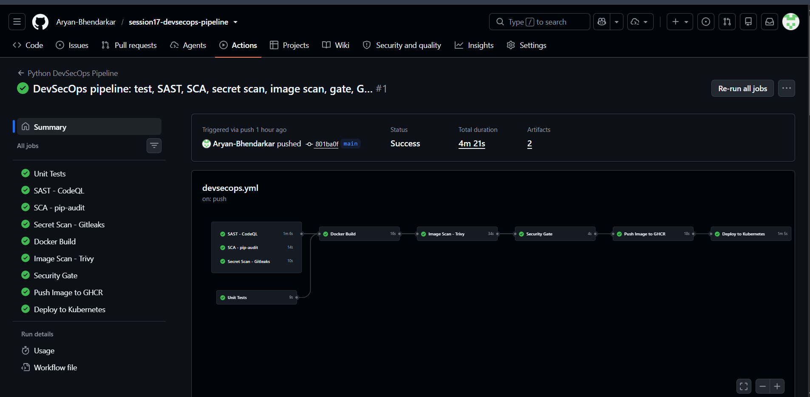
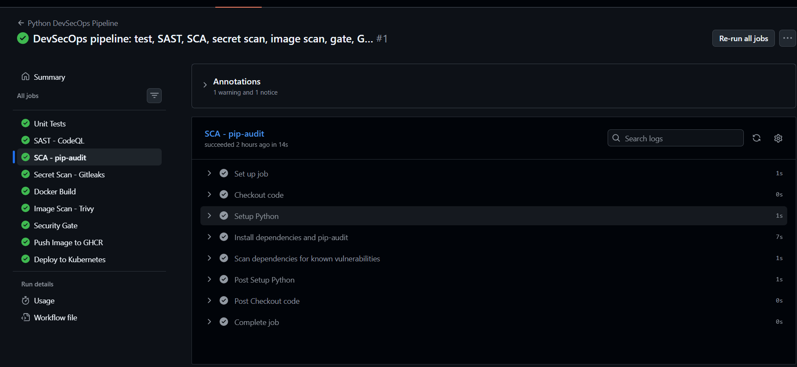
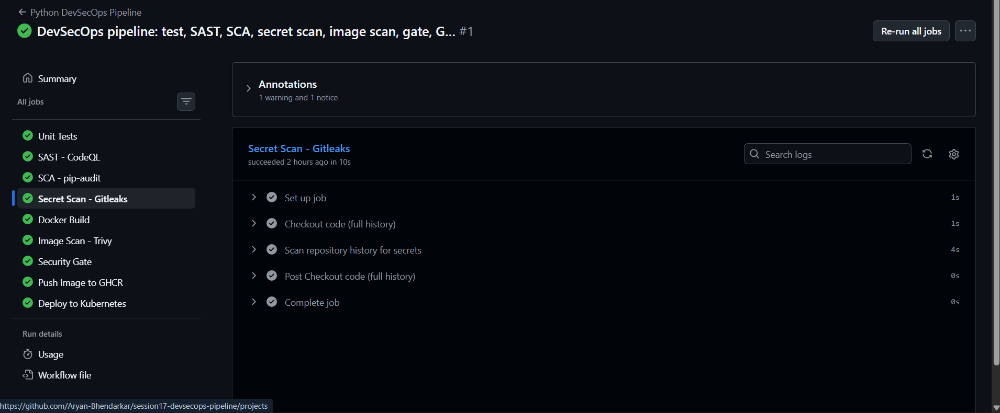
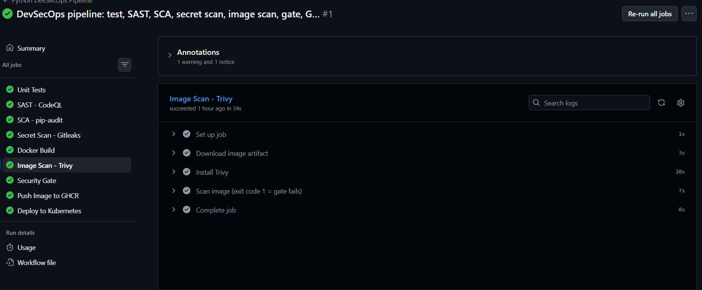
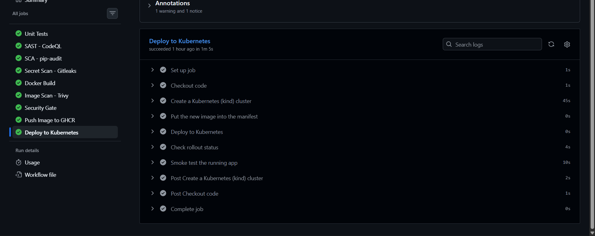
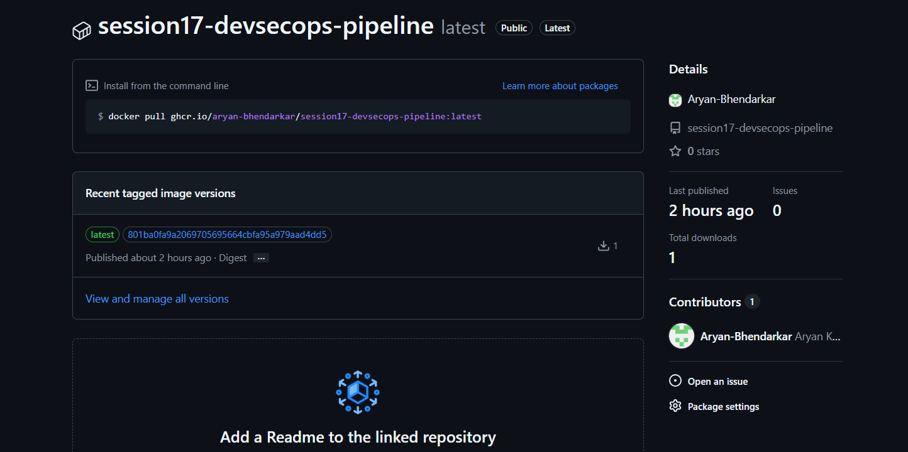

# Session 17: Complete CI/CD + DevSecOps Pipeline

**Repository (with the live pipeline):** https://github.com/Aryan-Bhendarkar/session17-devsecops-pipeline
**Image published by the pipeline:** `ghcr.io/aryan-bhendarkar/session17-devsecops-pipeline:latest`

Based on the teacher's `session-17-devsecops/demo` (Flask app, tests, Dockerfile, Kubernetes manifests, workflow). It lives in its own repository because GitHub Actions only runs workflows from `.github/workflows/` at the **root** of a repo.

---

## 1. What is DevSecOps?

DevSecOps puts **security checks inside the CI/CD pipeline**, so problems are found on every push, before the code is shipped ("shift left"). A **security gate** is a rule that stops the pipeline when a check fails.

| Security check | What it looks at | Tool used |
| :--- | :--- | :--- |
| **SAST** (Static Application Security Testing) | Our own source code for insecure patterns | GitHub **CodeQL** |
| **SCA** (Software Composition Analysis) | Third-party packages with known vulnerabilities (CVEs) | **pip-audit** |
| **Secret scanning** | Passwords, tokens and keys committed in the repo and its history | **Gitleaks** |
| **Container image scanning** | Vulnerabilities in the OS packages and libraries inside the Docker image | **Trivy** |
| **Security gate** | One job that depends on all the checks above. Nothing is pushed or deployed unless it opens | `security-gate` job |

## 2. Pipeline flow

```text
 Code (git push to main)
   │
   ├── Unit Tests (pytest + coverage) ──┐
   ├── SAST   (CodeQL)                  │
   ├── SCA    (pip-audit)               ├──► Docker Build (build ONCE, save as artifact)
   └── Secret Scan (Gitleaks)  ─────────┘            │
                                                     ▼
                                          Container Image Scan (Trivy, fails on HIGH/CRITICAL)
                                                     │
                                                     ▼
                                              SECURITY GATE (needs SAST + SCA + Secrets + Image scan)
                                                     │
                                                     ▼
                                          Push image to GitHub Container Registry (ghcr.io)
                                                     │
                                                     ▼
                                          Deploy to Kubernetes (kind cluster) + smoke test
```

Key design points (all in `.github/workflows/devsecops.yml`):
- `needs:` creates the order. A failed scan stops everything after it.
- **The image is built once** and passed to later jobs as an artifact (`docker save` / `docker load`). So the image that Trivy scans is exactly the image that gets pushed.
- Push and deploy only run on a push to `main` (`if: github.event_name == 'push' && github.ref == 'refs/heads/main'`), not on pull requests.
- The registry login uses `${{ secrets.GITHUB_TOKEN }}`, a secret GitHub creates automatically for each run. No password is stored in the code.

## 3. Deliverables

```text
session17-devsecops-pipeline/
├── app/                          Flask application (dashboard + REST API)
├── tests/test_app.py             unit tests (pytest)
├── Dockerfile                    python:3.12-slim, installs requirements, runs the app on port 5001
├── requirements.txt              Flask==3.1.3 (runtime, what SCA scans)
├── requirements-dev.txt          pytest, pytest-cov
├── pytest.ini
├── k8s/deployment.yaml           2 replicas, image placeholder filled in by the pipeline
├── k8s/service.yaml              NodePort service (80 → 5001)
├── .github/workflows/devsecops.yml   the CI/CD + DevSecOps workflow
├── .gitignore  .gitattributes
```

**Security tool configuration** lives in the workflow: CodeQL (`languages: python`), `pip-audit` on `requirements.txt`, Gitleaks with full git history (`fetch-depth: 0`), and Trivy with this policy:
```bash
trivy image --input image.tar --severity HIGH,CRITICAL --ignore-unfixed --exit-code 1
```
`--exit-code 1` makes the job fail (and closes the gate) if any HIGH/CRITICAL vulnerability **with an available fix** is found. `--ignore-unfixed` hides vulnerabilities nobody can fix yet, a common policy so the pipeline only fails on things we can act on.

## 4. Changes I made to the teacher's demo (and why)

| Teacher's demo | Mine | Reason |
| :--- | :--- | :--- |
| Pushed to Docker Hub as the teacher's account using `DOCKERHUB_TOKEN` | Pushes to **GitHub Container Registry** using `GITHUB_TOKEN` | I don't have that account/secret, and `GITHUB_TOKEN` needs no setup |
| No secret scan | Added **Gitleaks** job | The assignment requires secret scanning |
| Trivy only printed results, so it could never fail | Added `--exit-code 1` and a dedicated **Security Gate** job | The assignment requires security gates |
| Image rebuilt separately for scan and for push | Build once, share via artifact | Guarantees the scanned image is the shipped image |
| Hard-coded teacher's image name in the k8s manifest | `__IMAGE__` placeholder replaced by the pipeline | Works for any owner and any commit |
| `app.run(..., debug=True)` bound to `0.0.0.0` | `debug=os.environ.get("FLASK_DEBUG") == "1"` | See below |

**A real security issue fixed:** `app/app.py` started Flask with `debug=True` on host `0.0.0.0`. Flask's debug mode exposes an interactive debugger (remote code execution risk) on every network interface, and it would also have run inside the container. CodeQL has a rule for exactly this. I made debug mode opt-in through an environment variable, and checked locally that the container now logs `Debug mode: off`.

## 5. Successful pipeline run

**Run #1 (commit `801ba0f`): all 9 jobs green, 4 m 21 s.** Unit Tests, SAST, SCA and Secret Scan ran in parallel → Docker Build → Image Scan → Security Gate → Push → Deploy.



**SCA, pip-audit:** the dependency scan step passed.



**Secret scan, Gitleaks:** scanned the full repository history and passed.



**Image scan, Trivy:** scanned the built image and passed the HIGH/CRITICAL policy ("Scan image (exit code 1 = gate fails)").



**Deploy to Kubernetes:** a kind cluster was created in the runner, the manifest was updated with the new image, applied, the rollout checked, and the running app smoke-tested.



**Container registry:** the image is published on GHCR with the tags `latest` and the commit SHA.



## 6. Not done, and limits

- I did not stage a deliberate failure (for example, adding a fake secret or a vulnerable package) to watch the gate close, so the gate is configured but only its passing path was demonstrated.
- CodeQL does not fail the job by itself. Its findings, if any, appear under **Security → Code scanning** in the repo.
- Kubernetes deployment runs in a temporary `kind` cluster inside the GitHub runner, which proves the manifests and image work. A real cluster would need a kubeconfig stored as a secret.
- The security checks are a classroom-level baseline, not a complete security programme.

## 7. Run locally

```bash
pip install -r requirements-dev.txt && pytest --cov=app        # unit tests
docker build -t session17 . && docker run -p 5001:5001 session17   # then open http://localhost:5001/health
kubectl apply -f k8s/service.yaml   # (deployment.yaml needs __IMAGE__ replaced with a real image first)
```

## 8. What I learned

- Security checks belong in the pipeline: SAST for our code, SCA for dependencies, secret scanning for leaked credentials, image scanning for the container.
- A **security gate** is just `needs:` on all scan jobs plus scanners that return a failing exit code.
- Build the image once, then scan and ship that exact image.
- Scanners found a real issue in the teacher's code (Flask `debug=True`), which is the whole point of shifting security left.
