## Task 1: Cluster Health Verification & Baseline Environment Checks

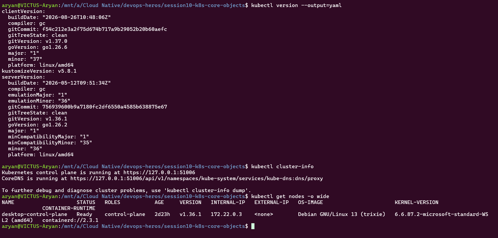
---

## Task 2: Standard Pod Deployment, Extended Inspection & Teardown (pod.yml)

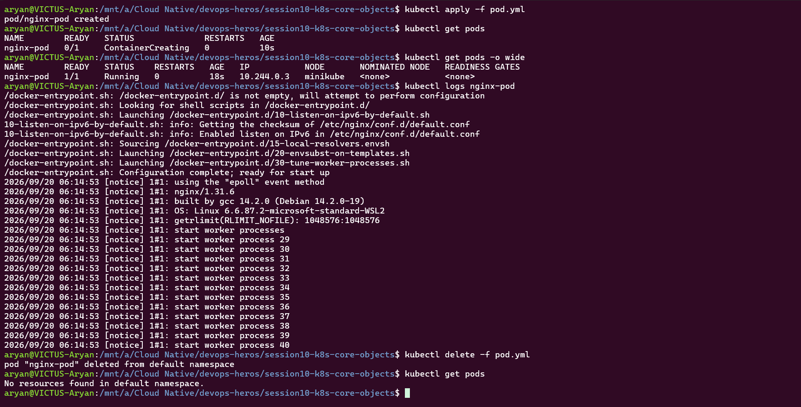

---

## Task 3: Error State Simulation — ErrImagePull & ImagePullBackOff
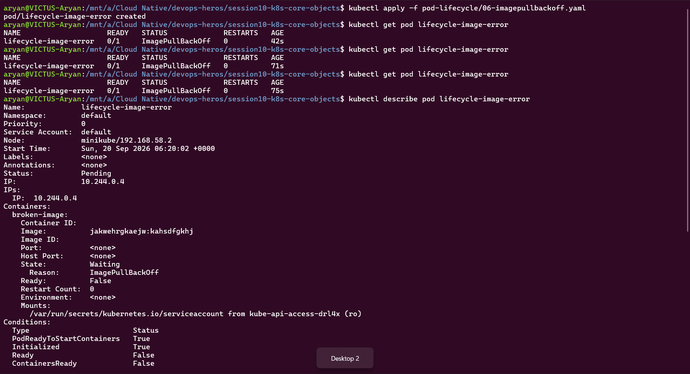
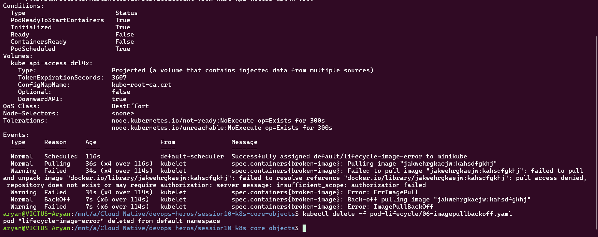

## Task 4: Capturing Transient Pod Lifecycle Stages (hello.yml)
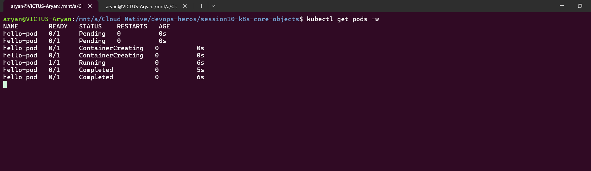
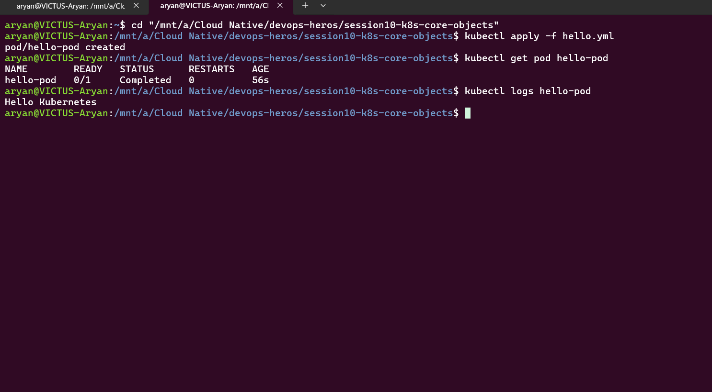

## Task 5: Exhaustive Pod Lifecycle States & Probes Lab (pod-lifecycle/)

a. 
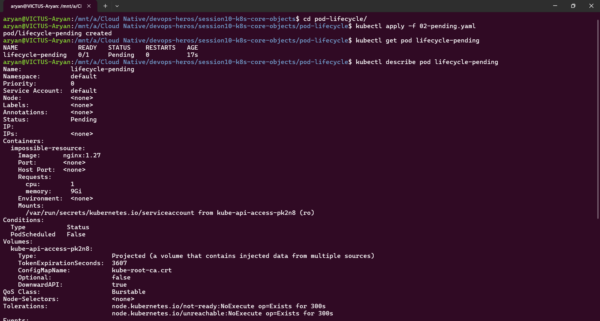

b. 
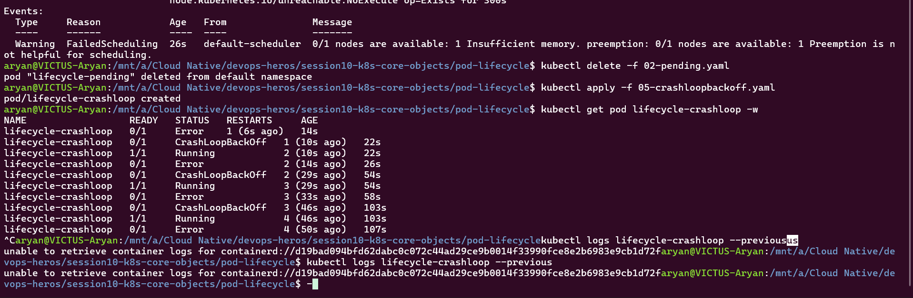

c. 
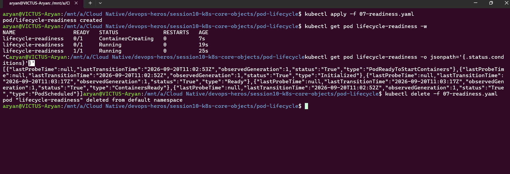

d. 
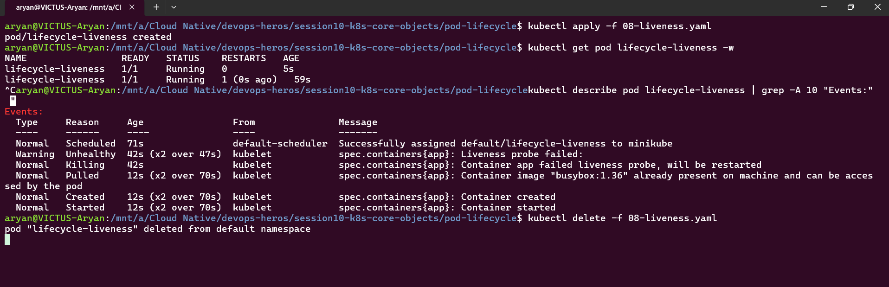

e. 
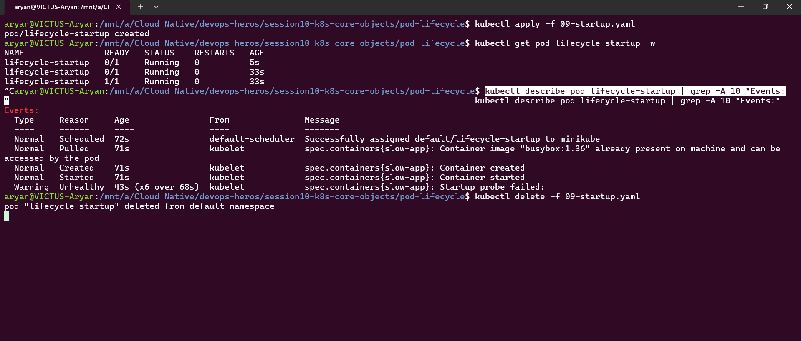

f. 
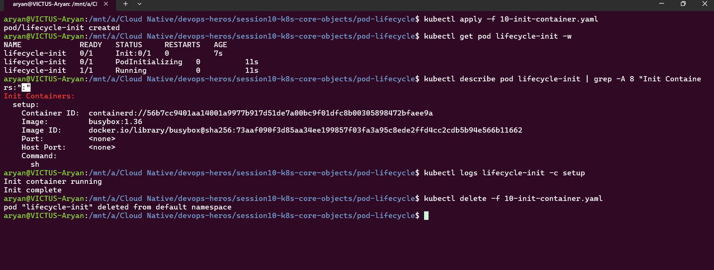

g. 
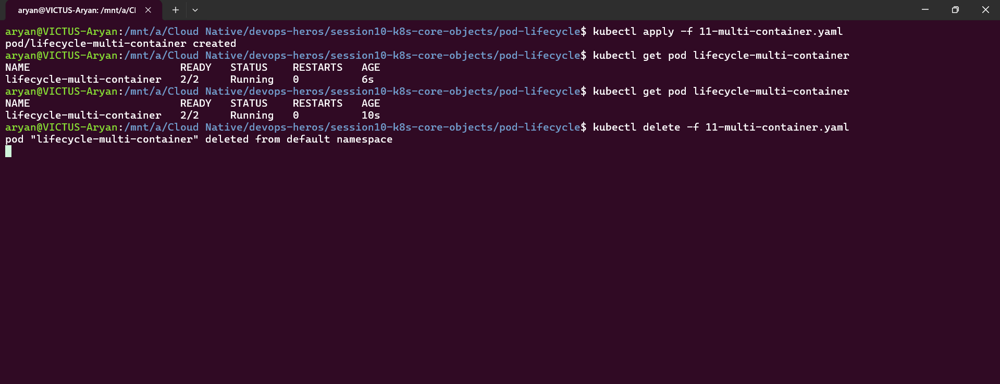

h. 
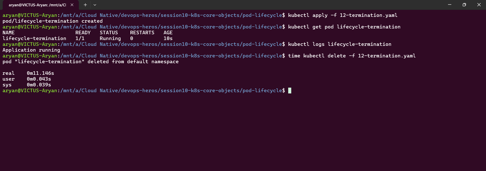

## Task 6: Core Controller Objects Exploration (ReplicaSet & StatefulSet)

### Part A: ReplicaSet — Self-Healing (replicaset.yml)
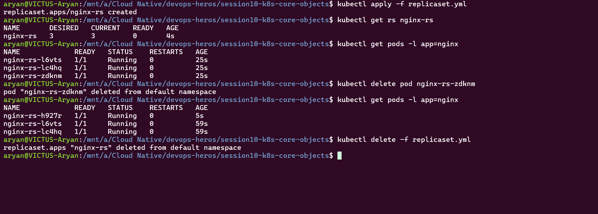

### Part B: StatefulSet — Ordinal Identity & Storage (statefulset.yml)
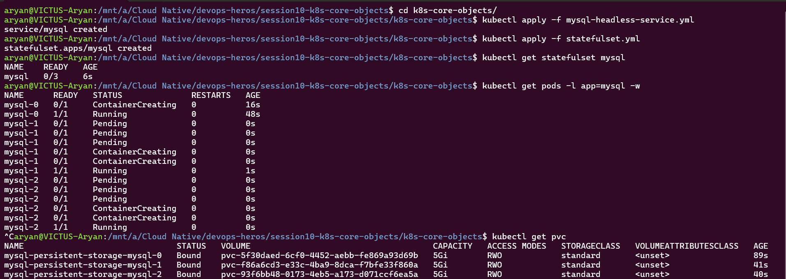

## Task 7: DaemonSet Architecture & Host Agent Deployment

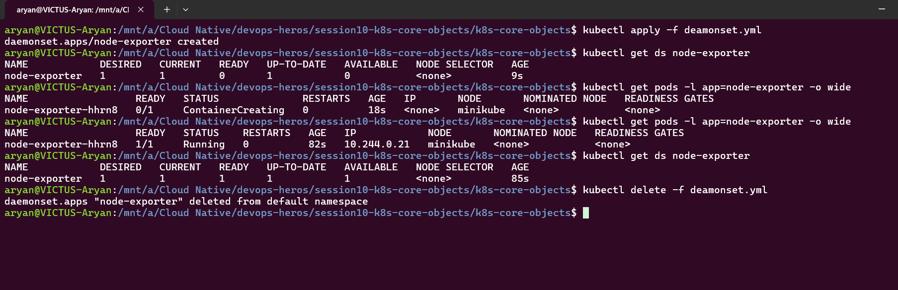

## Task 8: Deployment Upgrades, Rolling Updates & Instant Rollbacks

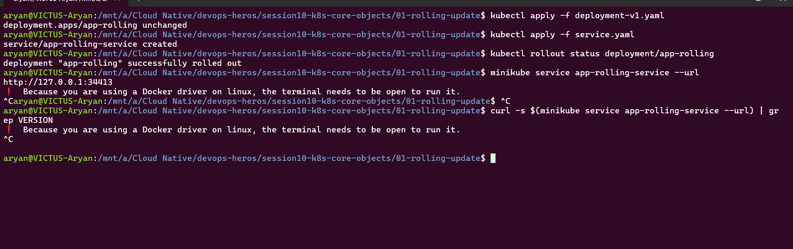
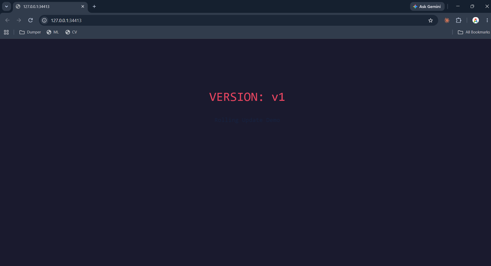
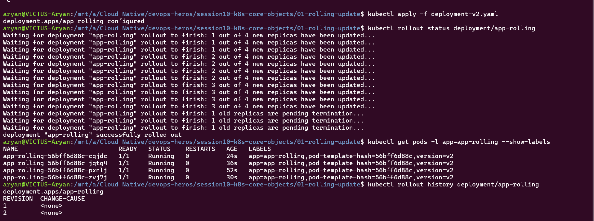
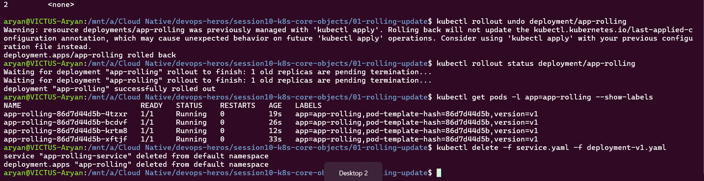

## Task 9: Blue-Green Deployment
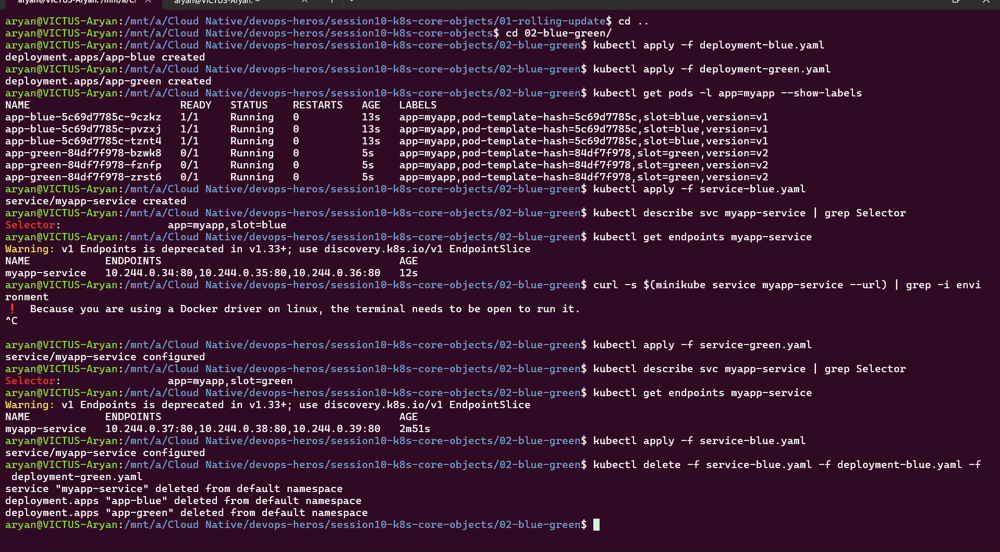

## Task 10: Canary Deployment
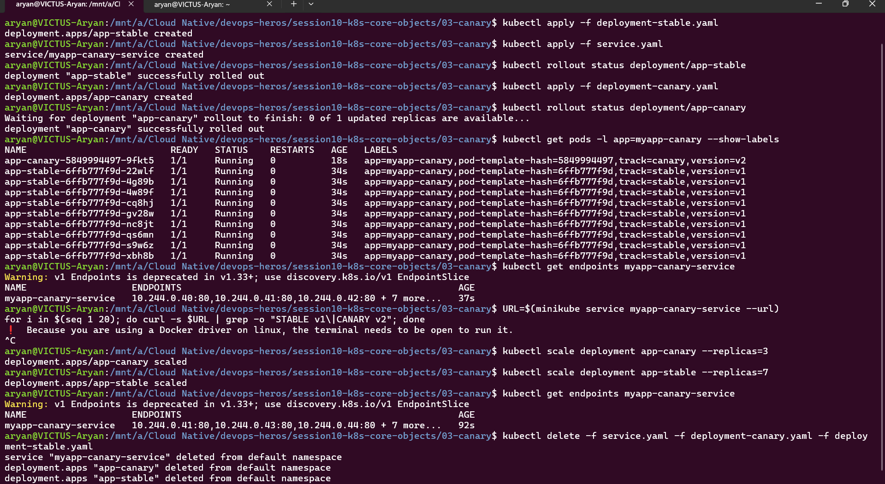