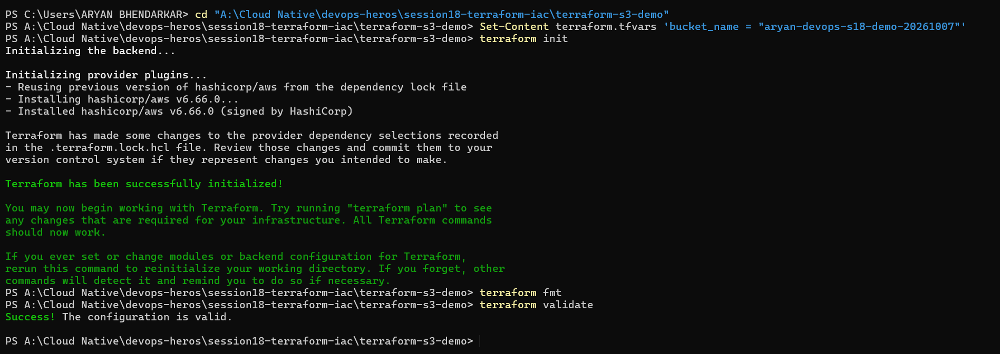
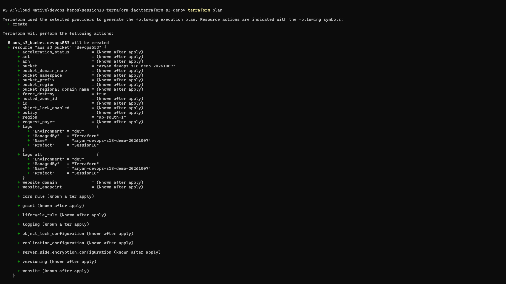
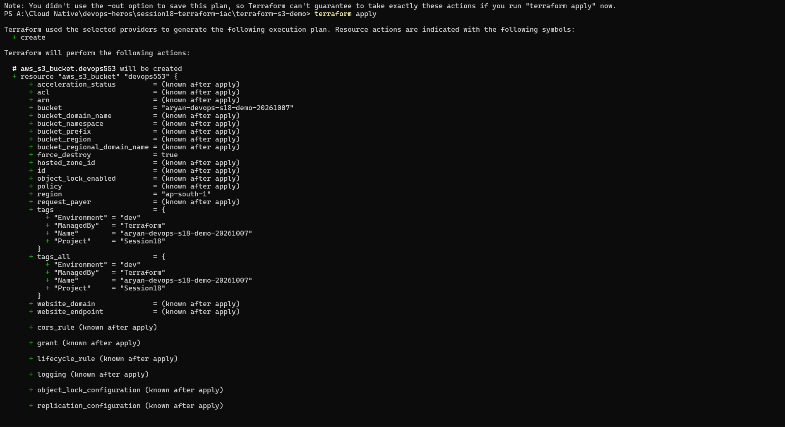
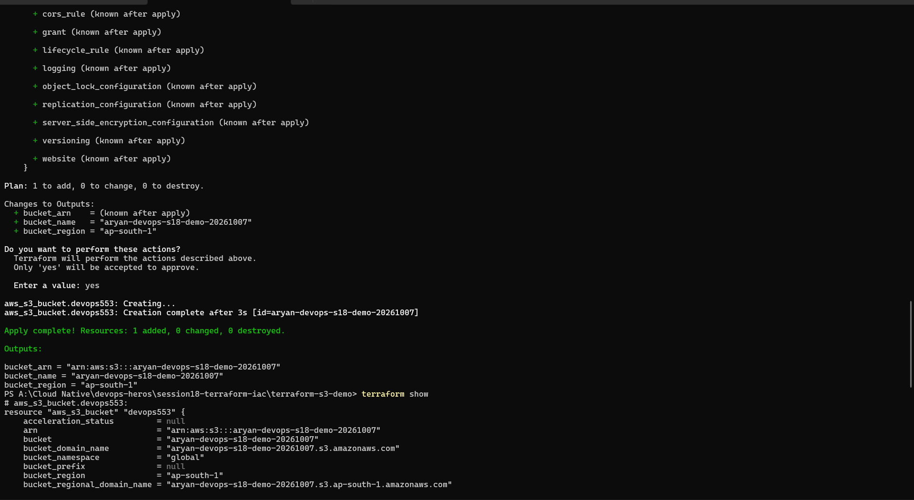
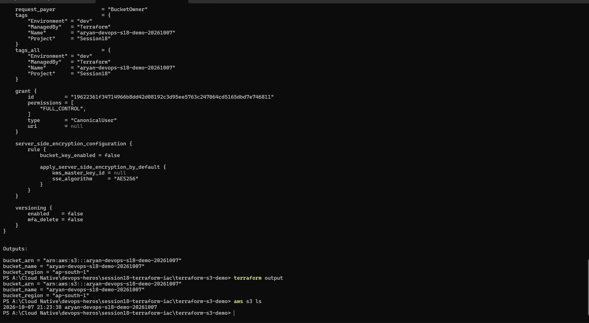
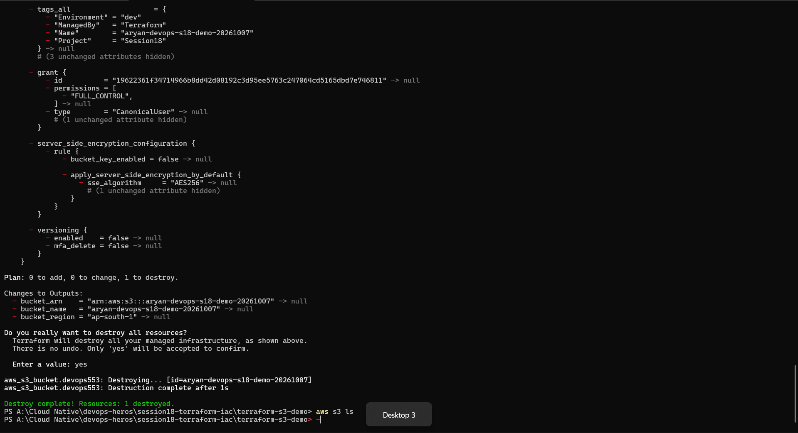

# Session 18 Homework: Terraform & Infrastructure as Code

## Concepts

**Infrastructure as Code (IaC)** means describing infrastructure (servers, buckets, networks) in code files instead of clicking in a console. The code can be versioned in git, reviewed, repeated and destroyed, so environments are reproducible.

**Terraform** is an IaC tool. You write the **desired state** in `.tf` files, and Terraform works out what to create, change or delete to match it.

```text
.tf files (desired state) ──terraform plan──► what will change ──terraform apply──► real resources (AWS)
                                                                          │
                                                       terraform.tfstate (Terraform's record of what exists)
```

Terraform talks to AWS through a **provider** plugin (`hashicorp/aws`), which `terraform init` downloads.

---

## Task 1: Terraform S3 Demo

Project: [`../terraform-s3-demo/`](../terraform-s3-demo/) (the teacher's project, used as provided). Environment: Terraform on Windows, AWS region `ap-south-1`.

### Project files

| File | Purpose |
| :--- | :--- |
| `terraform.tf` | Terraform settings: required version `>= 1.6.0` and provider `hashicorp/aws ~> 6.0` |
| `providers.tf` | Configures the AWS provider, `region = var.aws_region` |
| `variables.tf` | Input variables: `aws_region` (default `ap-south-1`) and `bucket_name` |
| `terraform.tfvars` | My values for the variables (see below) |
| `main.tf` | The resource: `aws_s3_bucket.devops553` with tags `Environment=dev`, `ManagedBy=Terraform`, `Project=Session18`, and `force_destroy = true` |
| `outputs.tf` | Outputs: `bucket_name`, `bucket_arn`, `bucket_region` |
| `.terraform.lock.hcl` | Records the exact provider version (v6.66.0) |

S3 bucket names are **globally unique across all of AWS**, so the default name from the demo was likely taken. I set my own in `terraform.tfvars`:
```hcl
bucket_name = "aryan-devops-s18-demo-20261007"
```
(`*.tfvars` is listed in the project's `.gitignore`, since variable files can hold secrets, so this file stays local and is shown here.)

### Workflow

**1. `terraform init`:** downloads the AWS provider and prepares the folder. **2. `terraform fmt`:** formats the code (it prints nothing when files are already formatted). **3. `terraform validate`:** checks the configuration for syntax and consistency errors.

```text
PS> terraform init       → Terraform has been successfully initialized!   (installed hashicorp/aws v6.66.0)
PS> terraform fmt        → (no output: already formatted)
PS> terraform validate   → Success! The configuration is valid.
```


**4. `terraform plan`:** a dry run showing what *would* happen, without changing anything. It reported `Plan: 1 to add, 0 to change, 0 to destroy`: one `aws_s3_bucket` named `aryan-devops-s18-demo-20261007` in `ap-south-1` with the four tags. Values marked `(known after apply)` (ARN, ID...) only exist once AWS creates the bucket.



**5. `terraform apply`:** shows the plan again, asks for confirmation (`yes`) and creates the resource.
```text
aws_s3_bucket.devops553: Creation complete after 3s [id=aryan-devops-s18-demo-20261007]
Apply complete! Resources: 1 added, 0 changed, 0 destroyed.
```
**6. `terraform show`:** prints the current **state**, i.e. the full real attributes of the bucket (ARN, tags, default AES256 encryption, versioning disabled...). **7. `terraform output`:** prints the output values:
```text
bucket_arn    = "arn:aws:s3:::aryan-devops-s18-demo-20261007"
bucket_name   = "aryan-devops-s18-demo-20261007"
bucket_region = "ap-south-1"
```
I also checked in AWS independently with `aws s3 ls`, and the bucket was listed (`aryan-devops-s18-demo-20261007`).





**8. `terraform destroy`:** shows what will be deleted (`Plan: 0 to add, 0 to change, 1 to destroy`), asks for `yes`, then deletes it.
```text
aws_s3_bucket.devops553: Destruction complete after 1s
Destroy complete! Resources: 1 destroyed.
```
`aws s3 ls` afterwards returned nothing, confirming the bucket is gone, so no ongoing cost.



### What I learned
- The cycle is **write → init → validate → plan → apply → (destroy)**. `plan` is the safety step: always read it before `apply`.
- The **state file** is how Terraform knows what it manages. `show` displays it, and `destroy` uses it to know what to delete.
- Variables (`variables.tf` + `terraform.tfvars`) keep values out of the resource code, and outputs expose useful results.
- Bucket names are global, and `terraform.tfvars` and `*.tfstate` should not be committed (they can contain secrets).
- `terraform fmt` only prints the files it changed, so no output means nothing needed fixing.

---

## Task 2: AWS Services Research

One README per service, in [`../aws-services/`](../aws-services/):

| Folder | Service | Covers |
| :--- | :--- | :--- |
| [01-iam](../aws-services/01-iam/README.md) | IAM (governance) | users, groups, roles, policies, permissions, least privilege, best practices, use cases |
| [02-ec2](../aws-services/02-ec2/README.md) | EC2 (compute) | AMI, instance types, key pairs, security groups, EBS, public vs private IP, lifecycle, use cases |
| [03-s3](../aws-services/03-s3/README.md) | S3 (storage) | buckets, objects, storage classes, versioning, lifecycle, encryption, bucket policies, use cases |
| [04-vpc](../aws-services/04-vpc/README.md) | VPC (networking) | CIDR, subnets, route tables, Internet and NAT gateways, security groups vs NACLs, public vs private subnets |
| [05-dynamodb-rds](../aws-services/05-dynamodb-rds/README.md) | DynamoDB & RDS (databases) | NoSQL tables/items/keys, RDS engines, instances, security, backups, Multi-AZ, read replicas, use cases |

The S3 notes connect to Task 1: the bucket Terraform created showed default AES256 encryption, versioning disabled and a `FULL_CONTROL` owner grant in `terraform show`.
