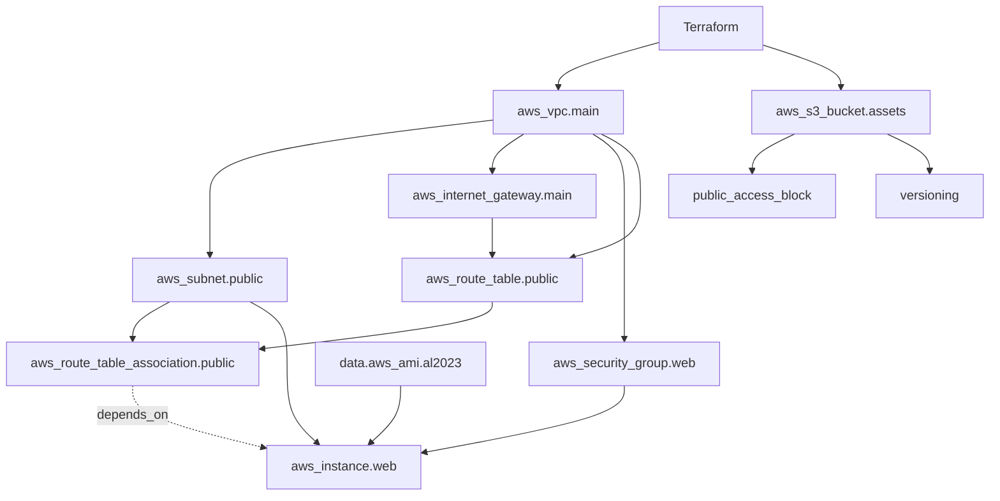
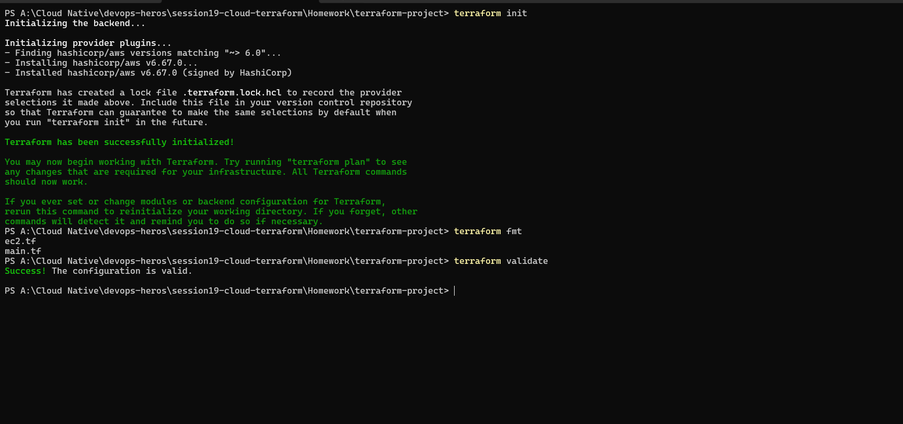
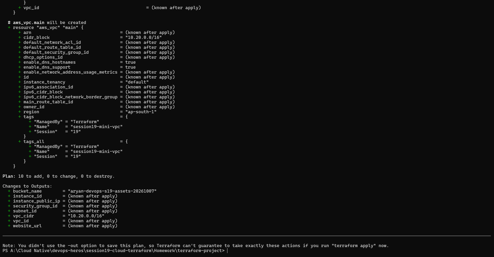
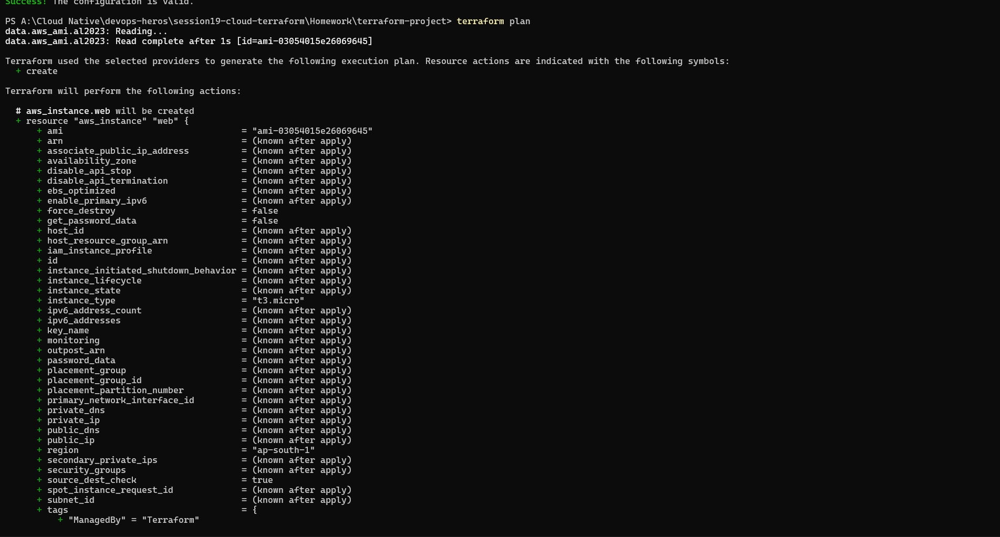
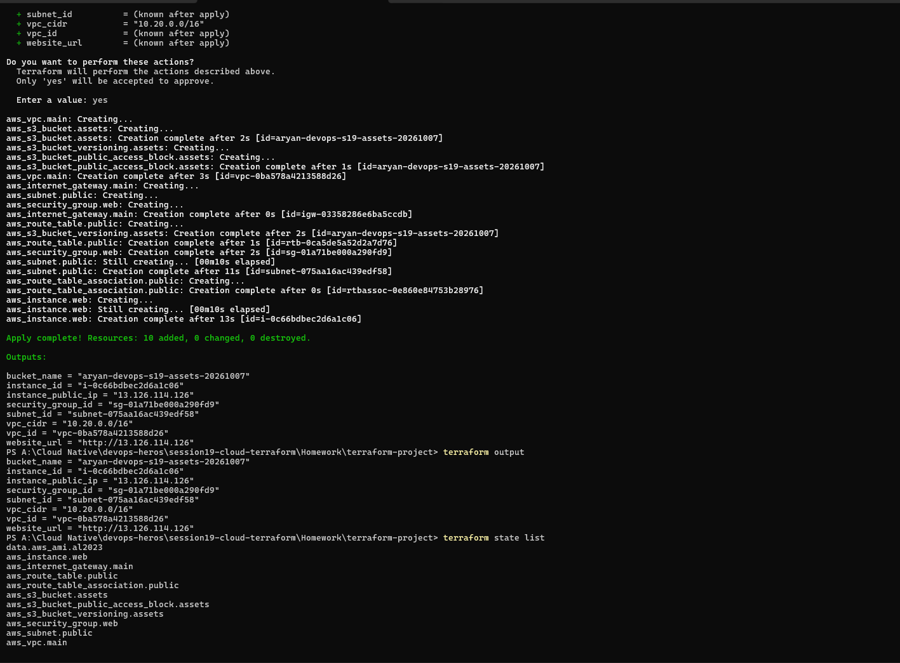
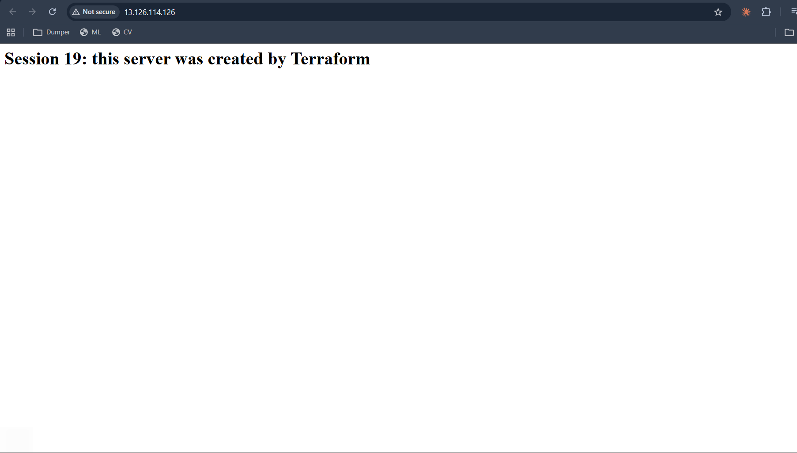
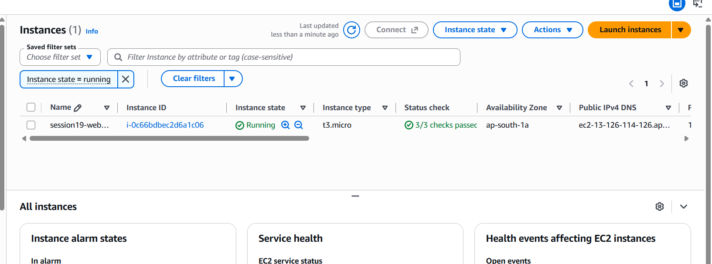
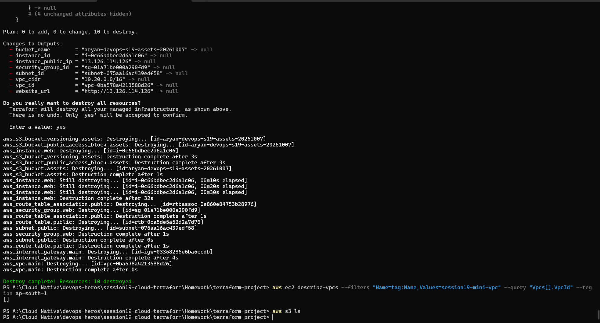

# Session 19: Cloud & Terraform in Action

An end-to-end AWS infrastructure project built with Terraform: a **VPC** with a public **subnet**, **internet gateway** and **route table**, a **security group**, an **EC2** web server and an **S3** bucket. All of it is created, inspected and destroyed with Terraform commands.

Project folder: [`terraform-project/`](terraform-project/). It is based on the teacher's `08-mini-project` (the VPC, subnet, gateway, route table and security group), to which I added `ec2.tf` and `s3.tf`, two variables and four outputs, as the suggested architecture requires EC2 and S3. The teacher's original folder is untouched.

Environment: Terraform v1.16, AWS provider v6.67, region `ap-south-1` (Mumbai).

---

## 1. Architecture

```text
                              Internet
                                 │
                                 ▼
                        Internet Gateway (igw)
                                 │
   ┌─────────────────────────────┼───────────────── AWS region ap-south-1 ───┐
   │   VPC  10.20.0.0/16         │                                            │
   │                      Route Table (public)                                │
   │                       0.0.0.0/0 → igw                                    │
   │                             │                                            │
   │              ┌──────────────┴─────────────┐                              │
   │              │ Public Subnet 10.20.1.0/24 │                              │
   │              │      (ap-south-1a)         │                              │
   │              │   ┌────────────────────┐   │                              │
   │              │   │ Security Group     │   │                              │
   │              │   │ in: 80, 443        │   │                              │
   │              │   │  ┌──────────────┐  │   │                              │
   │              │   │  │ EC2 t3.micro │  │   │                              │
   │              │   │  │  (web server)│  │   │                              │
   │              │   │  └──────────────┘  │   │                              │
   │              │   └────────────────────┘   │                              │
   │              └────────────────────────────┘                              │
   └──────────────────────────────────────────────────────────────────────────┘

   S3 bucket (private, versioned)   ← created by the same Terraform project
```



## 2. How the project demonstrates each concept

| Concept | Where in the code |
| :--- | :--- |
| **Provider** | `versions.tf`: `hashicorp/aws ~> 6.0` plus `provider "aws" { region = var.aws_region }`. `terraform init` downloaded provider v6.67.0 |
| **Variables** | `variables.tf`: `aws_region` (default `ap-south-1`), `instance_type` (default `t3.micro`), `bucket_name` (no default, supplied in `terraform.tfvars`) |
| **Resources** | `main.tf` (network: VPC, subnet, IGW, route table, association, security group), `ec2.tf` (EC2 instance), `s3.tf` (bucket, public-access block, versioning). 10 resources in total |
| **Data source** | `data "aws_ami" "al2023"` *reads* the newest Amazon Linux 2023 image. It creates nothing, so it appears in the state but not in the "10 to add" |
| **Outputs** | `outputs.tf`: `vpc_id`, `vpc_cidr`, `subnet_id`, `security_group_id`, `instance_id`, `instance_public_ip`, `website_url`, `bucket_name` |
| **Dependencies** | See section 3 |
| **State** | `terraform state list` shows what Terraform manages (section 5). The state file `terraform.tfstate` stays local and is gitignored |

`terraform.tfvars` (local, gitignored because variable files may hold secrets):
```hcl
aws_region  = "ap-south-1"
bucket_name = "aryan-devops-s19-assets-20261007"   # S3 names are globally unique
```

## 3. Dependencies

**Implicit dependencies**: Terraform builds the order from references. For example `aws_subnet.public` uses `aws_vpc.main.id`, so the VPC is created first; the EC2 instance uses `aws_subnet.public.id` and `aws_security_group.web.id`, so both come before it.

**Explicit dependency** (`depends_on`): the EC2 instance does not *reference* the route table association, but it needs internet access while booting (its `user_data` installs the web server). So `ec2.tf` says:
```hcl
depends_on = [aws_route_table_association.public]
```
The apply log shows the result, with the association created before the instance:
```text
aws_route_table_association.public: Creation complete after 0s
aws_instance.web: Creating...
```
**Destroy runs in reverse**: the instance was destroyed first, then the association, security group, subnet, route table, internet gateway, and the VPC last, as the destroy log shows.

---

## 4. Terraform workflow (screenshots)

### `terraform init`, `terraform fmt`, `terraform validate`
`init` downloaded the AWS provider (v6.67.0) and created the lock file. `fmt` fixed the formatting of `ec2.tf` and `main.tf` and printed their names. `validate` said `Success! The configuration is valid.`



### `terraform plan`
A dry run: `Plan: 10 to add, 0 to change, 0 to destroy`, with the 8 outputs. Nothing is created yet.




### `terraform apply`, `terraform output`, `terraform state list`
`apply` created everything in about a minute: `Apply complete! Resources: 10 added, 0 changed, 0 destroyed.` `output` printed the values (including `instance_public_ip` and `website_url`).



## 5. Terraform state

`terraform state list` after the apply:
```text
data.aws_ami.al2023
aws_instance.web
aws_internet_gateway.main
aws_route_table.public
aws_route_table_association.public
aws_s3_bucket.assets
aws_s3_bucket_public_access_block.assets
aws_s3_bucket_versioning.assets
aws_security_group.web
aws_subnet.public
aws_vpc.main
```
The **state** is Terraform's record of the real resources it manages (IDs, attributes). `plan` compares your code to the state and to reality, and `destroy` uses it to know what to delete. It can contain sensitive data, so `*.tfstate` is never committed.

## 6. Verifying the AWS resources

**The web server works.** After giving the server time to boot, I opened the `website_url` (`http://<public-ip>`) in a browser, and it served the page created by the instance's boot script: *"Session 19: this server was created by Terraform"*.



**In the AWS console** (EC2 → Instances, region Mumbai): `session19-web-server`, type `t3.micro`, `Running`, status checks `3/3 passed`, in `ap-south-1a`.



## 7. `terraform destroy`

`plan -destroy` showed `Plan: 0 to add, 0 to change, 10 to destroy.` `destroy` ended with `Destroy complete! Resources: 10 destroyed.` I then checked AWS directly: the VPC lookup returned `[]` and `aws s3 ls` listed no buckets, so nothing is left running or billing.



## 8. Commands used

```bash
terraform init               # download providers
terraform fmt                # format code
terraform validate           # check configuration
terraform plan               # preview changes (dry run)
terraform apply              # create resources (type yes)
terraform output             # show output values
terraform state list         # list resources in the state
terraform plan -destroy      # preview deletion
terraform destroy            # delete everything (type yes)
```

## 9. Notes and limits

- The security group allows HTTP (80) and HTTPS (443) from anywhere, and has **no SSH rule** and no key pair, so the server can't be logged into. That is deliberate (open SSH to `0.0.0.0/0` is risky), and it isn't needed for this demo. The instance also requires IMDSv2.
- Only port 80 is served (HTTP). I did not set up HTTPS.
- State is stored locally, which is fine for a demo. Teams normally use a remote backend such as S3 with locking.
- The EC2 instance bills by the hour, so I destroyed everything immediately after capturing the screenshots.

## 10. What I learned
- Terraform builds a dependency graph from references, and `depends_on` covers dependencies that aren't visible in the code.
- `plan` before `apply`, always. `destroy` runs in the reverse dependency order.
- A data source reads existing information (like the latest AMI) without creating anything.
- Variables and `terraform.tfvars` keep environment-specific values out of the resource code.
- Always verify from outside Terraform (browser, console, `aws` CLI) and clean up to avoid cost.
