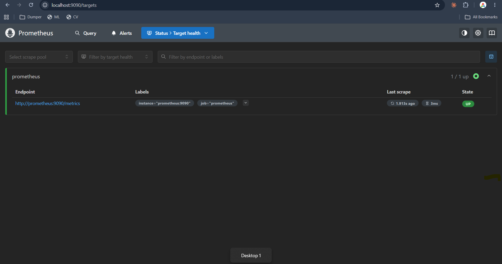
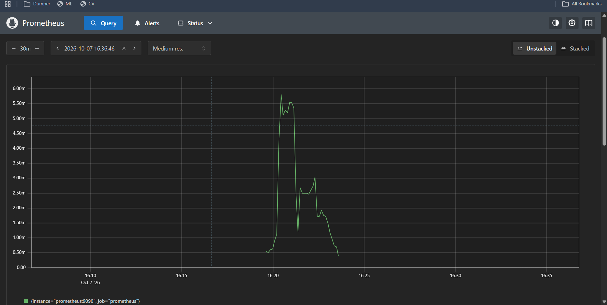
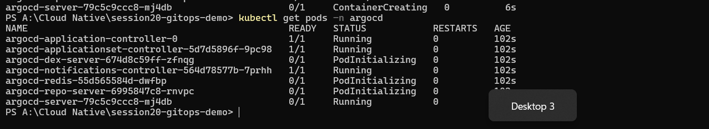
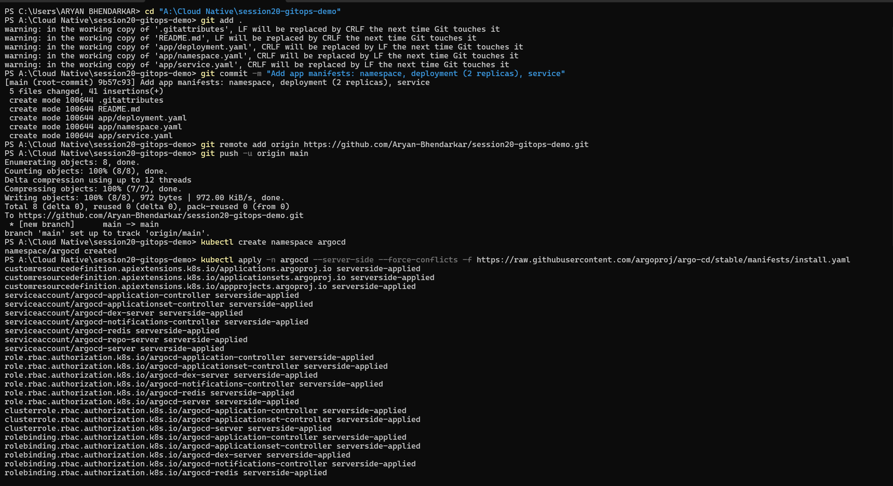
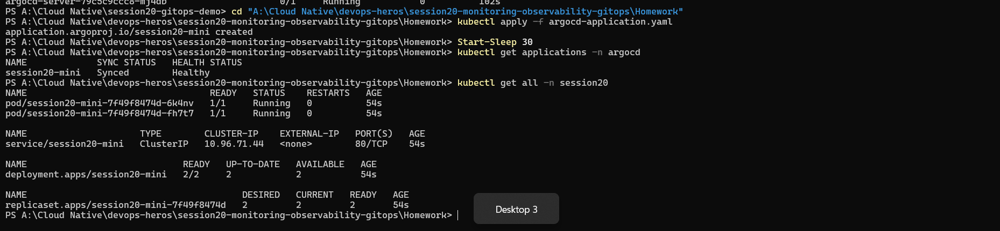
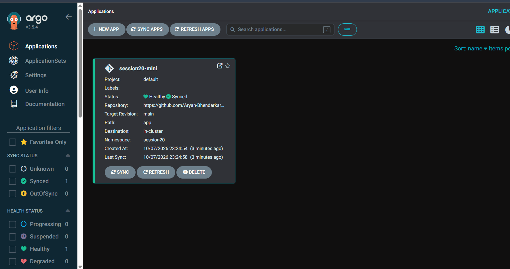

# Session 20: Monitoring, Observability & GitOps

**What was run for real** is marked **[DEMO]** with screenshots. **[THEORY]** sections are documentation only. Section 4 lists exactly what I did not execute.

---

## Task 1: Monitoring

**Monitoring** means collecting and watching data about a system so you know *when something is wrong*. It answers known questions: "is it up?", "is CPU high?", "is the error rate rising?".

| Topic | What it is | Typical examples |
| :--- | :--- | :--- |
| **Metrics** | Numbers sampled over time | CPU %, memory bytes, requests per second, error count |
| **Logs** | Timestamped text records of events | `ERROR: database connection failed` |
| **Alerts** | Rules that notify a human when a metric crosses a threshold | "CPU above 80% for 5 min → send Slack message / page on-call" |
| **CPU utilization** | How busy the processor is. A sustained high value means a bottleneck, and in Kubernetes it drives autoscaling (HPA, Session 13) | `rate(process_cpu_seconds_total[1m])`, `kubectl top` |
| **Memory utilization** | How much RAM is used. Memory that keeps growing signals a leak, and exceeding the limit gets a container OOMKilled | `process_resident_memory_bytes`, `kubectl top` |
| **Application health** | Is the app alive and ready? Health endpoints (`/health`), Kubernetes probes, and Prometheus's `up` metric (1 = scrape succeeded) | Targets page, `up` |

### [DEMO] Prometheus monitoring itself (teacher's `04-grafana/docker-compose.yml`)

**Prometheus** is a metrics system: it **scrapes** (pulls) a `/metrics` endpoint on each target every few seconds (here every 5 s, from `prometheus.yml`) and stores the time series. **Grafana** turns such data into dashboards.

**Application health:** the Prometheus *Targets* page shows the `prometheus` job as **1/1 up** with state **UP**, scraped a couple of seconds earlier (endpoint `http://prometheus:9090/metrics`).



**Metrics:** a graph of a Prometheus query over the last 30 minutes for the Prometheus process itself (the query text is not visible in this screenshot). It is a series with the labels `instance="prometheus:9090", job="prometheus"`, with values in the milli range, consistent with a CPU-usage rate query, rising when I interacted with the UI and falling afterwards.



Queries used for this demo: `up` (health), `rate(process_cpu_seconds_total[1m])` (CPU) and `process_resident_memory_bytes` (memory).

---

## Task 2: Observability [THEORY]

**Observability** is the ability to understand what is happening *inside* a system from the data it produces, including problems you did not predict. Monitoring tells you *that* something is wrong; observability helps you find out *why*.

### The three pillars

| Pillar | Meaning | Answers | Example |
| :--- | :--- | :--- | :--- |
| **Metrics** | Aggregated numbers over time (cheap, good for trends and alerts) | "Is something wrong? How bad?" | Requests/s, p95 latency, CPU |
| **Logs** | Detailed, timestamped event records | "What exactly happened?" | A stack trace, "payment failed for order 123" |
| **Traces** | The path of **one request** through many services, split into timed *spans* | "Where did the time go / which service failed?" | A checkout request: API → cart → payment → database, with the time spent in each |

```text
Alert fires (metric)  →  find the failing service (trace)  →  read the error details (logs)
```

### Why observability is required
- Modern systems are **distributed** (many microservices, containers, nodes), so a single failing request may touch ten components.
- Containers and Pods are **short-lived**. When a Pod dies, its local logs and state disappear unless they were shipped elsewhere.
- Failures are often **unknown unknowns**: dashboards built for known problems can't explain new ones.
- It shortens **MTTR** (time to detect and fix), supports SLOs and capacity planning, and makes releases safer.

### Common tools

| Purpose | Tools |
| :--- | :--- |
| Metrics collection and storage | **Prometheus**, Thanos / Mimir, CloudWatch, Datadog |
| Dashboards | **Grafana** |
| Alerting | **Alertmanager** (Prometheus), Grafana Alerting, PagerDuty |
| Logs | **Loki**, ELK/EFK (Elasticsearch, Fluentd/Fluent Bit, Kibana), CloudWatch Logs |
| Traces | **Jaeger**, Tempo, Zipkin |
| Instrumentation standard | **OpenTelemetry** (one set of SDKs/collector for metrics, logs and traces) |
| All-in-one (SaaS) | Datadog, New Relic, Dynatrace |

### Kubernetes observability

| Signal | How it is gathered in Kubernetes |
| :--- | :--- |
| **Resource metrics** | **metrics-server** gives `kubectl top nodes/pods` and powers the HPA |
| **Cluster and app metrics** | **Prometheus** (often installed with the *kube-prometheus-stack*) scrapes the kubelet/cAdvisor (container CPU, memory), **kube-state-metrics** (Deployment, Pod and replica state) and application `/metrics` endpoints; **Grafana** dashboards display them |
| **Logs** | `kubectl logs` for a single Pod; a log agent running on each node (Fluent Bit, Promtail) ships container logs to Loki/Elasticsearch so they survive Pod deletion |
| **Events** | `kubectl get events` / `kubectl describe` (scheduling failures, image pull errors, probe failures) |
| **Health** | Liveness, readiness and startup probes (Session 13) decide restarts and traffic |
| **Traces** | Apps instrumented with OpenTelemetry send spans to Jaeger/Tempo; a service mesh can add them automatically |
| **Alerts** | Prometheus alert rules → Alertmanager → Slack / email / PagerDuty |

---

## Task 3: GitOps

### Concepts [THEORY]
**GitOps** is a way to operate infrastructure and applications where **everything is described in Git and an automated agent makes reality match it**.

| Principle | Meaning |
| :--- | :--- |
| **Git as the source of truth** | The desired state of the system lives in a Git repository. The repo, not someone's laptop or the cluster, is the authority. Every change is a commit with history, review (pull request) and easy rollback (`git revert`) |
| **Declarative configuration** | You describe *what* you want (e.g. "2 replicas of this image") in YAML, not *how* to get there with step-by-step commands |
| **Continuous reconciliation** | An agent inside the cluster (Argo CD, Flux) constantly compares the Git state with the live state and fixes any difference. If someone changes the cluster by hand (drift), it is reverted (**self-heal**) |
| **Pull-based delivery** | The agent *pulls* from Git from inside the cluster, so CI doesn't need cluster credentials |

```text
Developer ──commit/PR──► Git repo (desired state)
                              ▲
                              │ Argo CD pulls & compares
                              ▼
                   Kubernetes cluster (actual state)  ←── reconciles (auto-sync, self-heal, prune)
```

**GitOps workflow:** 1) change the YAML in Git and open a pull request, 2) review and merge, 3) Argo CD detects the new commit, 4) it syncs the cluster to match, 5) it reports `Synced` / `Healthy`. **To roll back, revert the commit in Git.**

**Kubernetes + GitOps:** Kubernetes is already declarative (you apply desired state), so GitOps adds the missing piece: the desired state lives in Git, and a controller applies it. **Argo CD** does this with an `Application` object that names the repo, path, branch and target namespace.

### [DEMO] Argo CD deploying from Git

Files: the app manifests (`namespace.yaml`, `deployment.yaml` with 2 replicas, `service.yaml`) are the teacher's, from `08-mini-project/app/`. I put them in **my own GitHub repo** `session20-gitops-demo` under `app/`, and wrote [`argocd-application.yaml`](argocd-application.yaml) pointing at it. It sits outside that repo's `app/` folder because the Application object tells Argo CD what to watch and must not be one of the watched manifests.

```yaml
source:
  repoURL: https://github.com/Aryan-Bhendarkar/session20-gitops-demo.git
  targetRevision: main
  path: app
destination:
  server: https://kubernetes.default.svc
  namespace: session20
syncPolicy:
  automated:
    prune: true       # remove cluster resources that were deleted from Git
    selfHeal: true    # undo manual changes made directly in the cluster
  syncOptions:
    - CreateNamespace=true
```

**Step 1: install Argo CD** into the existing Docker Desktop cluster:
```bash
kubectl create namespace argocd
kubectl apply -n argocd --server-side --force-conflicts -f https://raw.githubusercontent.com/argoproj/argo-cd/stable/manifests/install.yaml
kubectl get pods -n argocd
```
(`--server-side` is needed because one Argo CD resource is too large for a normal apply.) All 7 Argo CD components came up `Running`. The first screenshot was taken while some were still starting.




**Step 2: create the Application:** `kubectl apply -f argocd-application.yaml`. Argo CD pulled the repo and created everything itself. I never ran `kubectl apply` on the app manifests. Result: **Synced / Healthy**, with 2 pods, a Service, a Deployment and a ReplicaSet in namespace `session20`.



**Step 3: Argo CD web UI** (via `kubectl port-forward svc/argocd-server -n argocd 8080:443`): the `session20-mini` application shows repository `github.com/Aryan-Bhendarkar/...`, target revision `main`, path `app`, namespace `session20`, status **Healthy** and **Synced**.



---

## 4. What I did NOT execute

I want this to be clear rather than overstated:

- **Task 1:** I did not complete the Grafana part (data source and dashboard), the `kubectl top` CPU/memory screenshots, or a working alert rule. Alerts, CPU and memory are covered in the theory table only. My PC crashed during the session and I chose to move on.
- **Task 3:** I did not run the "change Git → cluster follows" demo (editing `replicas: 2` to `3`, pushing, and watching Argo CD sync) or the self-heal demo (scaling by hand and watching Argo CD revert it). Both are explained above under *continuous reconciliation* and *workflow*, and the Application is configured for them (`automated`, `selfHeal`, `prune`), but I have no screenshots of them.
- Task 2 is documentation only, as the task asks.

## 5. What I learned
- Monitoring watches known signals; observability (metrics + logs + traces) lets you investigate unknown problems.
- Prometheus pulls metrics from targets, and the `up` metric and Targets page are the simplest application health check.
- GitOps makes Git the single source of truth: the cluster is changed by committing, not by running commands, and Argo CD keeps the cluster in sync with Git.
- An Argo CD `Application` is just a pointer: *which repo, which path, which cluster and namespace, and which sync policy*.
