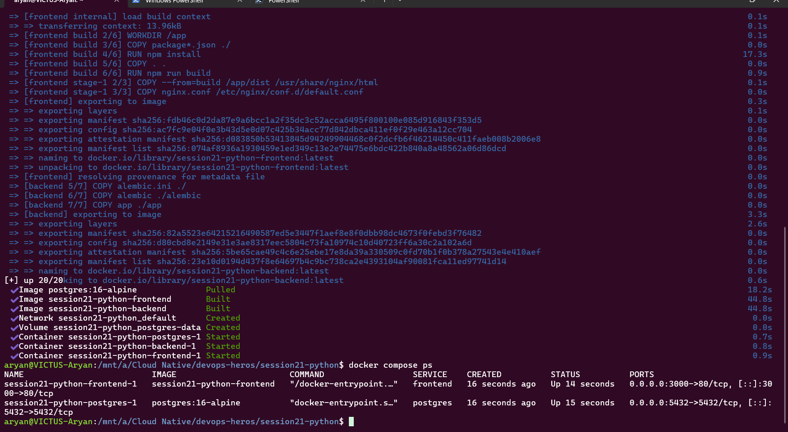
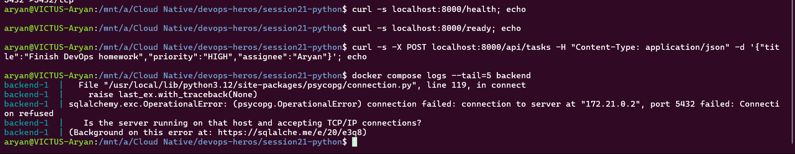
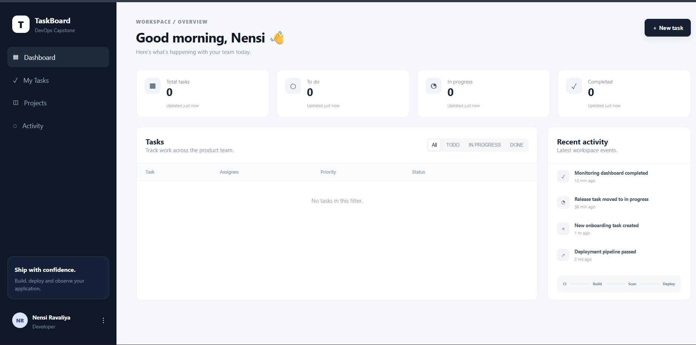
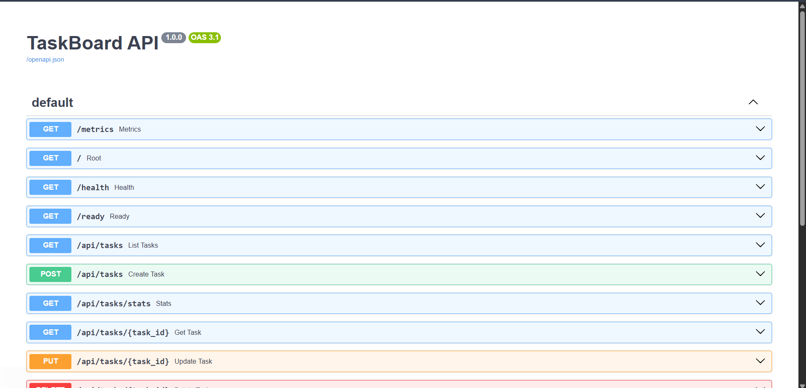

# Session 21: Running the TaskBoard Docker Compose Application

TaskBoard is a three-tier app, run here with the teacher's `docker-compose.yml`:

| Service | Image / build | Port | Role |
| :--- | :--- | :--- | :--- |
| `frontend` | built from `frontend/Dockerfile` (Node 22 builds the React app, nginx serves it) | `3000` → 80 | React + Vite web UI |
| `backend` | built from `backend/Dockerfile` (Python 3.12, FastAPI + SQLAlchemy). On start it runs `alembic upgrade head` (database migration), then `uvicorn` | `8000` | REST API (`/health`, `/ready`, `/api/tasks`, `/api/tasks/stats`, `/docs`) |
| `postgres` | `postgres:16-alpine`, data kept in the named volume `postgres-data` | `5432` | PostgreSQL database |

```text
Browser ──► frontend (nginx :3000) ──► backend (FastAPI :8000) ──► postgres (:5432)
```

## 1. Start the application

```bash
cd session21-python
docker compose up -d --build
docker compose ps
```
`--build` builds both images from their Dockerfiles, and `-d` runs the containers in the background. The build finished and the network, the volume and all three containers were created and started.

## 2. Problem: the backend crashed on startup

`docker compose ps` right after `up` listed only **`frontend`** and **`postgres`**. The **backend was missing**.



**Investigation:** `docker compose ps -a` showed the backend as `Exited (1)`, and the API calls (`/health`, `/ready`, `POST /api/tasks`) returned nothing. `docker compose logs backend` showed the cause:

```text
sqlalchemy.exc.OperationalError: (psycopg.OperationalError) connection failed:
connection to server at "172.21.0.2", port 5432 failed: Connection refused
Is the server running on that host and accepting TCP/IP connections?
```



**Root cause:** a **startup race condition**. `depends_on` only waits until the Postgres *container has started*, not until the *database is ready to accept connections*. The backend runs its migration (`alembic upgrade head`) immediately, Postgres was still initializing, so the connection was refused, the backend exited with code 1, and Compose does not restart it.

**Fix:** once Postgres was ready, start the backend again:
```bash
docker compose up -d backend
```
**Result after the fix:** all three containers were `Up` (`frontend` on 3000, `backend` on 8000, `postgres` on 5432), `curl localhost:8000/health` returned `{"status":"UP"}` and `curl localhost:8000/ready` returned `{"status":"READY"}` (the `/ready` endpoint also checks the database connection), and the backend log showed `Application startup complete` and `200 OK` for both requests.

### Verified: the running application (after the fix)

**Frontend**, `http://localhost:3000`: the TaskBoard dashboard (React app served by nginx) loads and shows the overview cards (Total, To do, In progress, Completed), the task table and the recent-activity panel. All counts are **0** because no task had been created successfully yet (my earlier `POST` was sent while the backend was down). The page loaded through nginx, which also proxies API calls to the backend.



**Backend API docs**, `http://localhost:8000/docs`: FastAPI's Swagger page "TaskBoard API 1.0.0" lists every endpoint: `GET /metrics`, `GET /`, `GET /health`, `GET /ready`, `GET` and `POST /api/tasks`, `GET /api/tasks/stats`, and `GET`, `PUT`, `DELETE /api/tasks/{task_id}`. This confirms the backend is running and serving.



**Proper permanent fix (not applied, since I used the teacher's compose file unchanged):** give Postgres a health check and make the backend wait for it:
```yaml
postgres:
  healthcheck:
    test: ["CMD-SHELL", "pg_isready -U taskboard -d taskboard"]
    interval: 3s
    retries: 10
backend:
  depends_on:
    postgres:
      condition: service_healthy
  restart: on-failure
```

## 3. Backend API reference (from `backend/app/main.py`)

| Method | Endpoint | Purpose |
| :--- | :--- | :--- |
| GET | `/health` | Liveness: is the process up? |
| GET | `/ready` | Readiness: also checks the database |
| GET | `/api/tasks` | List tasks |
| POST | `/api/tasks` | Create a task (`title`, `priority`, `status`, `assignee`) |
| GET / PUT / DELETE | `/api/tasks/{id}` | Read, update, delete one task |
| GET | `/api/tasks/stats` | Counts by status |

Commands I used to test it:
```bash
curl -s localhost:8000/health
curl -s localhost:8000/ready
curl -s -X POST localhost:8000/api/tasks -H "Content-Type: application/json" \
     -d '{"title":"Finish DevOps homework","priority":"HIGH","assignee":"Aryan"}'
curl -s localhost:8000/api/tasks
curl -s localhost:8000/api/tasks/stats
```

## 4. What I did NOT do or capture

- I did **not** run the three parts manually without Docker (frontend, backend and PostgreSQL started by hand). Only the Docker Compose method was run.
- I have **no screenshot of the `curl` API tests succeeding** (`/health`, `/ready`, `POST /api/tasks` returning a task `id`, the task list and stats). The only `curl` screenshot shows the calls failing while the backend was down. The success results in section 2 came from terminal output after the fix, and they are not screenshotted. The Swagger page and the frontend screenshots do show the backend and frontend running.
- No task was created, so the application was **not tested with data** (creating a task through the UI or the API and seeing it in the list and in `/api/tasks/stats`).

## 5. Clean up

```bash
docker compose down        # stop and remove containers (keeps the database volume)
docker compose down -v     # also delete the database volume
```

## 6. What I learned
- `docker compose up --build` builds images from Dockerfiles and starts the whole stack, and `docker compose ps -a` shows containers that exited.
- `depends_on` controls *start order*, not *readiness*. Use a health check and `condition: service_healthy` so dependent services wait for the database.
- Read `docker compose logs <service>` to find the real error: here the cause was `Connection refused` to the database, not a bug in the application.
- `/health` (liveness) and `/ready` (readiness, including the database) are different checks.
