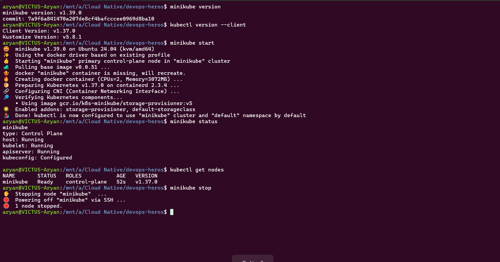

# Task - Minikube Installation, Environment Setup and Minikube Cluster Lifecycle Execution

---
### The four control plane pieces

*API server* — the only front door. kubectl, and every other component, talks to the cluster only through here. It validates requests and writes/reads from etcd. Nothing else talks to etcd directly.

*etcd* — a key-value database. Holds the entire cluster state: every object, every desired config. If etcd dies, the cluster has amnesia.

*Scheduler* — watches for pods that have no node assigned yet, picks the best-fit node (based on resources, constraints), and writes that decision back via the API server. It doesn't run anything — just decides where.

*Controller manager* — runs the reconciliation loops. Each loop asks "does actual state match desired state?" on repeat, forever. If you wanted 3 replicas and one crashed, a controller notices and creates a replacement. This is the "self-healing" you hear about — it's just a loop, not magic.

### The worker node pieces

*kubelet* — an agent running on every node. It watches the API server for "pods assigned to my node," and makes sure those containers are actually running via the container runtime (Docker/containerd).

*kube-proxy* — maintains the networking rules on each node so traffic reaches the right pod, no matter which node it's on.